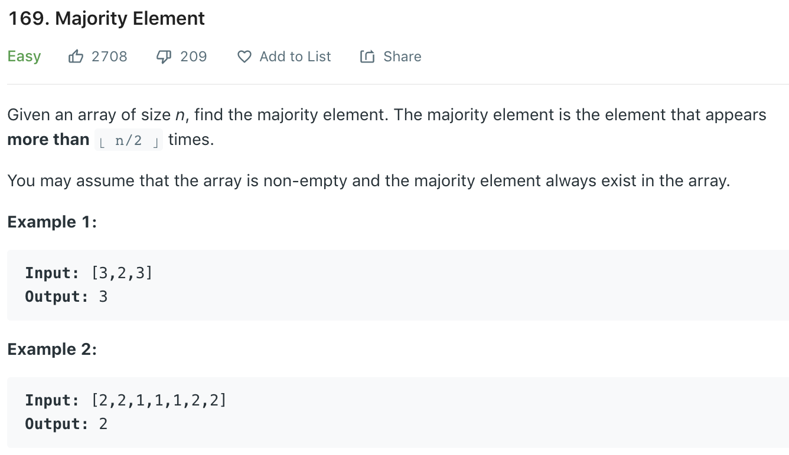

### Solution 1
```python
class Solution(object):
    def majorityElement(self, nums):
        """
        :type nums: List[int]
        :rtype: int
        """
        candidate, count = float('inf'), 0
        for num in nums:
            if num == candidate:
                count += 1
            elif count == 0:
                candidate, count = num, 1
            else:
                count -= 1
        
        return candidate
```

### Solution 2
```python
def majorityElement(self, nums):
    numdic = {}
    for n in nums:
        if n not in numdic:
            numdic[n] = 1
        else:
            numdic[n] += 1
    for v in numdic:
        if numdic[v] > len(nums)/2:
            return v
```