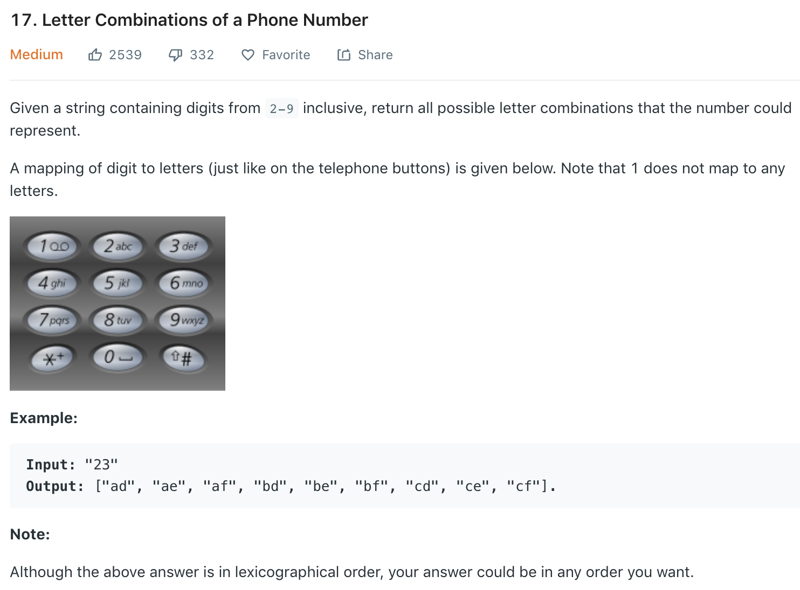

### Solution
Recursion with return value
```python
class Solution(object):
    def letterCombinations(self, digits):
        """
        :type digits: str
        :rtype: List[str]
        """
        if not digits: return []
        
        numToLetter = {'2': "abc", '3':"def", '4':"ghi", '5': "jkl", '6': "mno", '7':"pqrs", '8':"tuv", '9':"wxyz"}
        def helper(digits):
            if len(digits) == 1:
                return [l for l in numToLetter[digits]]
            res = []
            combs = helper(digits[1:])
            
            for comb in combs:
                for letter in numToLetter[digits[0]]:
                    res.append(letter + comb)
            
            return res
        
        return helper(digits)
```
Recursion without return val
```python
class Solution:
    def __init__(self):
        self.num2letter = {'2': 'abc', '3': 'def', '4': 'ghi', '5': 'jkl',
                           '6': 'mno', '7': 'pqrs', '8': 'tuv', '9': 'wxyz'}
    def letterCombinations(self, digits):
        ret = []
        if not digits:  return ret

        self.dfs(0, digits, "", ret)
        return ret

    def dfs(self, start, digits, path, res):
        if start == len(digits):
            res.append(path)
            return
        for letter in self.num2letter[digits[start]]:
            self.dfs(start + 1, digits, path + letter, res)
```