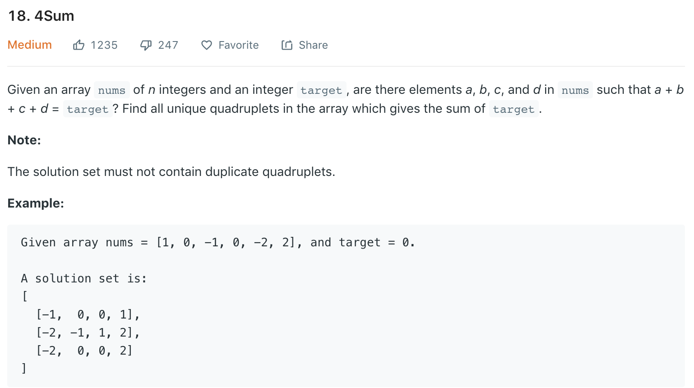

### Solution
We provide a general way to deal with N sum problem.
```python
class Solution(object):
    def fourSum(self, nums, target):
        """
        :type nums: List[int]
        :type target: int
        :rtype: List[List[int]]
        """
        def findNSum(l, r, N, target, path, res):
            # early termination
            if N < 2 or r - l + 1 < N or nums[l] * N > target or nums[r] * N < target:
                return
            # two pointers solve sorted 2-sum problem
            if N == 2:
                while l < r:
                    val = nums[l] + nums[r]
                    if val == target:
                        res.append(path + [nums[l], nums[r]])
                        l += 1
                        # handle duplicates
                        while l < r and nums[l] == nums[l - 1]:
                            l += 1
                    elif val < target:
                        l += 1
                    else:
                        r -= 1
                return
            # recursively reduce N
            for i in range(l,  r- N + 2):
                # filter duplicates
                if i > l and nums[i] == nums[i - 1]:
                    continue
                findNSum(i + 1, r, N - 1, target - nums[i], path + [nums[i]], res)
                
                        
        nums.sort()
        ans = []
        findNSum(0, len(nums) - 1, 4, target, [], ans)
        return ans
```