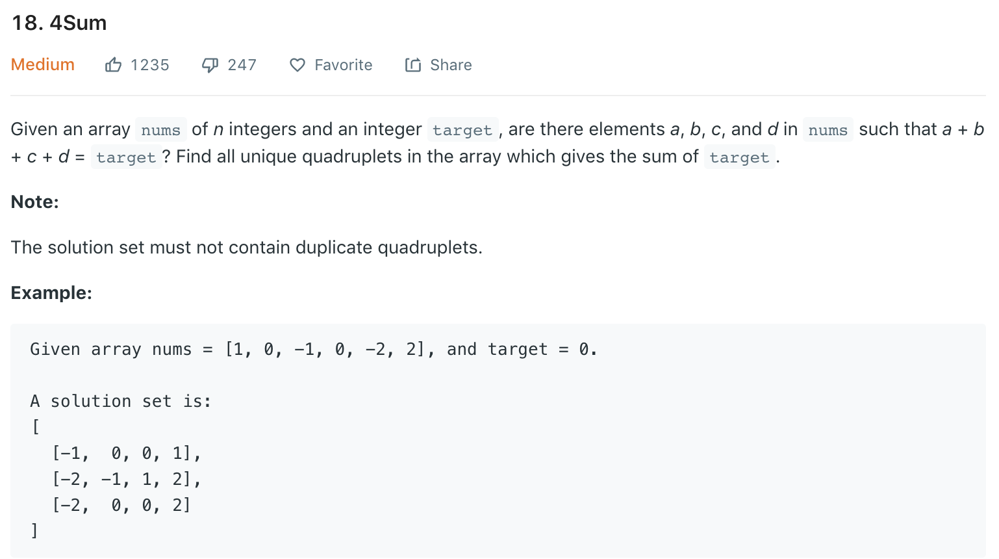

# 4 Sum

### Solution

TLE
```python
class Solution:
    def fourSum(self, nums: List[int], target: int) -> List[List[int]]:
        nums.sort()
        res = []
        def dfs(start, cur, rem):
            if len(cur) == 4:
                if rem == 0:
                    res.append(cur)
                return
            for i in range(start, len(nums)):
                if i > start and nums[i] == nums[i-1]:
                    continue
                #if nums[i] <= rem:
                dfs(i+1, cur + [nums[i]], rem - nums[i])
        dfs(0, [], target)
        return res
```

We provide a general way to deal with N sum problem.
```python
class Solution(object):
    def fourSum(self, nums, target):
        """
        :type nums: List[int]
        :type target: int
        :rtype: List[List[int]]
        """
        def findNSum(l, r, N, target, path, res):
            # early termination
            if N < 2 or r - l + 1 < N or nums[l] * N > target or nums[r] * N < target:
                return
            # two pointers solve sorted 2-sum problem
            if N == 2:
                while l < r:
                    val = nums[l] + nums[r]
                    if val == target:
                        res.append(path + [nums[l], nums[r]])
                        l += 1
                        # handle duplicates
                        while l < r and nums[l] == nums[l - 1]:
                            l += 1
                    elif val < target:
                        l += 1
                    else:
                        r -= 1
                return
            # recursively reduce N
            for i in range(l,  r- N + 2):
                # filter duplicates
                if i > l and nums[i] == nums[i - 1]:
                    continue
                findNSum(i + 1, r, N - 1, target - nums[i], path + [nums[i]], res)
                
                        
        nums.sort()
        ans = []
        findNSum(0, len(nums) - 1, 4, target, [], ans)
        return ans
```

```python
class Solution:
    def fourSum(self, nums: List[int], target: int) -> List[List[int]]:

        def kSum(nums: List[int], target: int, k: int) -> List[List[int]]:
            res = []

            # If we have run out of numbers to add, return res.
            if not nums:
                return res

            # There are k remaining values to add to the sum. The
            # average of these values is at least target // k.
            average_value = target // k

            # We cannot obtain a sum of target if the smallest value
            # in nums is greater than target // k or if the largest
            # value in nums is smaller than target // k.
            if average_value < nums[0] or nums[-1] < average_value:
                return res

            if k == 2:
                return twoSum(nums, target)

            for i in range(len(nums)):
                if i == 0 or nums[i - 1] != nums[i]:
                    for subset in kSum(nums[i + 1 :], target - nums[i], k - 1):
                        res.append([nums[i]] + subset)

            return res

        def twoSum(nums: List[int], target: int) -> List[List[int]]:
            res = []
            s = set()

            for i in range(len(nums)):
                if len(res) == 0 or res[-1][1] != nums[i]:
                    if target - nums[i] in s:
                        res.append([target - nums[i], nums[i]])
                s.add(nums[i])

            return res

        nums.sort()
        return kSum(nums, target, 4)
```