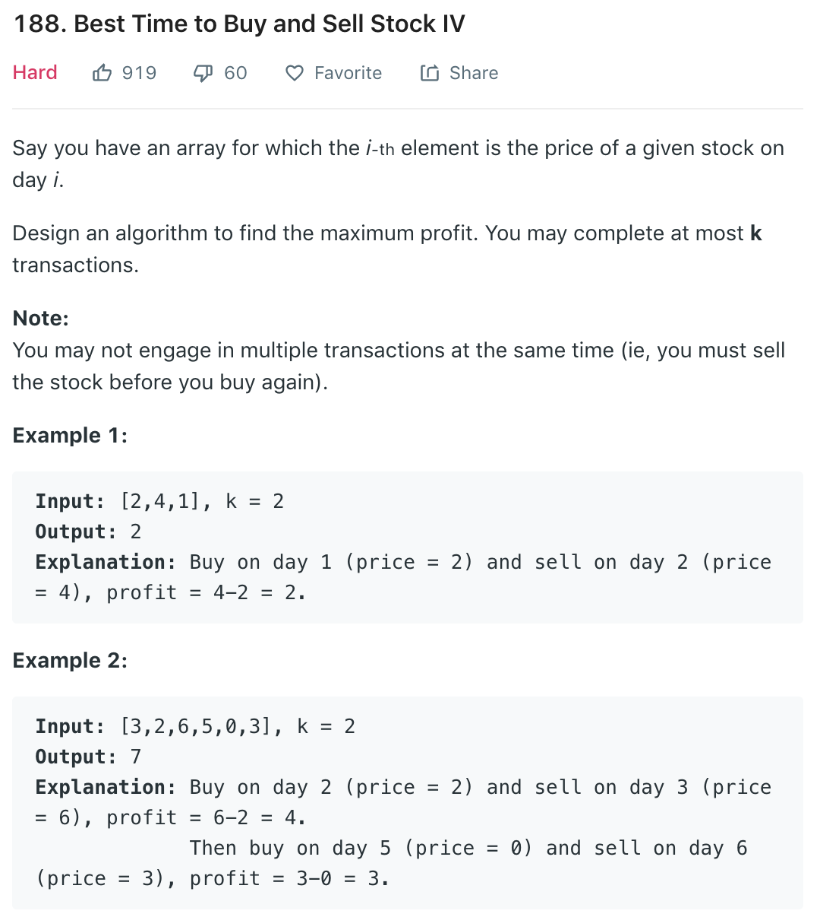

### Soluion DP
The `quickSolve` function is to tackle some corner cases to avoid TLE.

```
dp[i][j] = maximum profit from at most i transactions using prices[0..j]
```

A transaction is defined as one buy + sell.

Now on day j, we have two options

1. Do nothing (or buy) which doesn't change the acquired profit : dp[i][j] = dp[i][j-1]

2. Sell the stock: In order to sell the stock, you must've bought it on a day t=[0..j-1]. Maximum profit that can be attained is t:0->j-1 max(prices[j]-prices[t]+dp[i-1][t-1]) where prices[j]-prices[t] is the profit from buying on day t and selling on day j. dp[i-1][t-1] is the maximum profit that can be made with at most i-1 transactions with prices prices[0..t-1].

Time complexity of this approach is O(n2k).

In order to reduce it to O(nk), we must find t:0->j-1 max(prices[j]-prices[t]+dp[i-1][t-1]) this expression in constant time. If you see carefully,

```
t:0->j-1 max(prices[j]-prices[t]+dp[i-1][t-1])
```
is same as
```
prices[j] + t:0->j-1 max(dp[i-1][t-1]-prices[t])
```

Second part of the above expression maxTemp = t:0->j-1 max(dp[i-1][t-1]-prices[t]) can be included in the dp loop by keeping track of the maximum value till j-1.

Base case:
```
dp[0][j] = 0; dp[i][0] = 0
```

DP loop:
```
for i : 1 -> k
    maxTemp = -prices[0];
    for j : 1 -> n-1
        dp[i][j] = max(dp[i][j-1], prices[j]+maxTemp);
        maxTemp = max(maxTemp, dp[i-1][j-1]-prices[j]);
return dp[k][n-1];
```

```python
class Solution(object):
    def maxProfit(self, k, prices):
        """
        :type k: int
        :type prices: List[int]
        :rtype: int
        """
        lenp = len(prices)
        if k >= lenp // 2: return self.quickSolve(prices)

        dp = [[0] * lenp for _ in range(k + 1)]
        for i in range(1, k + 1):
            tmp = -prices[0]
            for j in range(1, lenp):
                dp[i][j] = max(dp[i][j - 1], prices[j] + tmp)
                tmp = max(tmp, dp[i - 1][j - 1] - prices[j])

        return dp[k][lenp - 1]

    # if can do transaction everyday, then maxProfit is the sum of all increasing gap.
    def quickSolve(self, prices):
        lenp, profit = len(prices), 0
        for i in range(1, lenp):
            if prices[i] > prices[i - 1]:
                profit += prices[i] - prices[i - 1]

        return profit
```