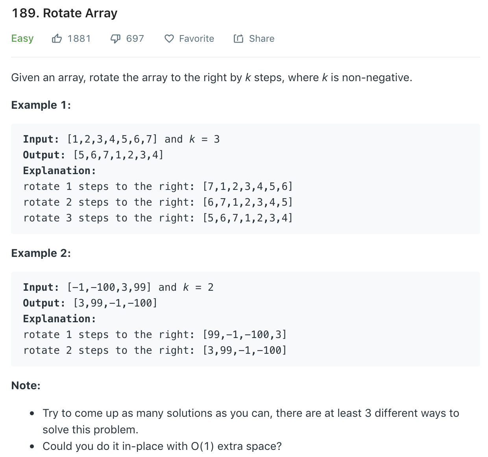

### Solution
```python
def rotate(nums, k):
    """
    :type nums: List[int]
    :type k: int
    :rtype: None Do not return anything, modify nums in-place instead.
    """
    n = len(nums)
    k %= n
    
    def reverse(nums, l, r):
        while l < r:
            nums[l], nums[r] = nums[r], nums[l]
            l += 1
            r -= 1
    
    reverse(nums, 0, n - 1)
    reverse(nums, 0, k - 1)
    reverse(nums, k, n - 1)
```