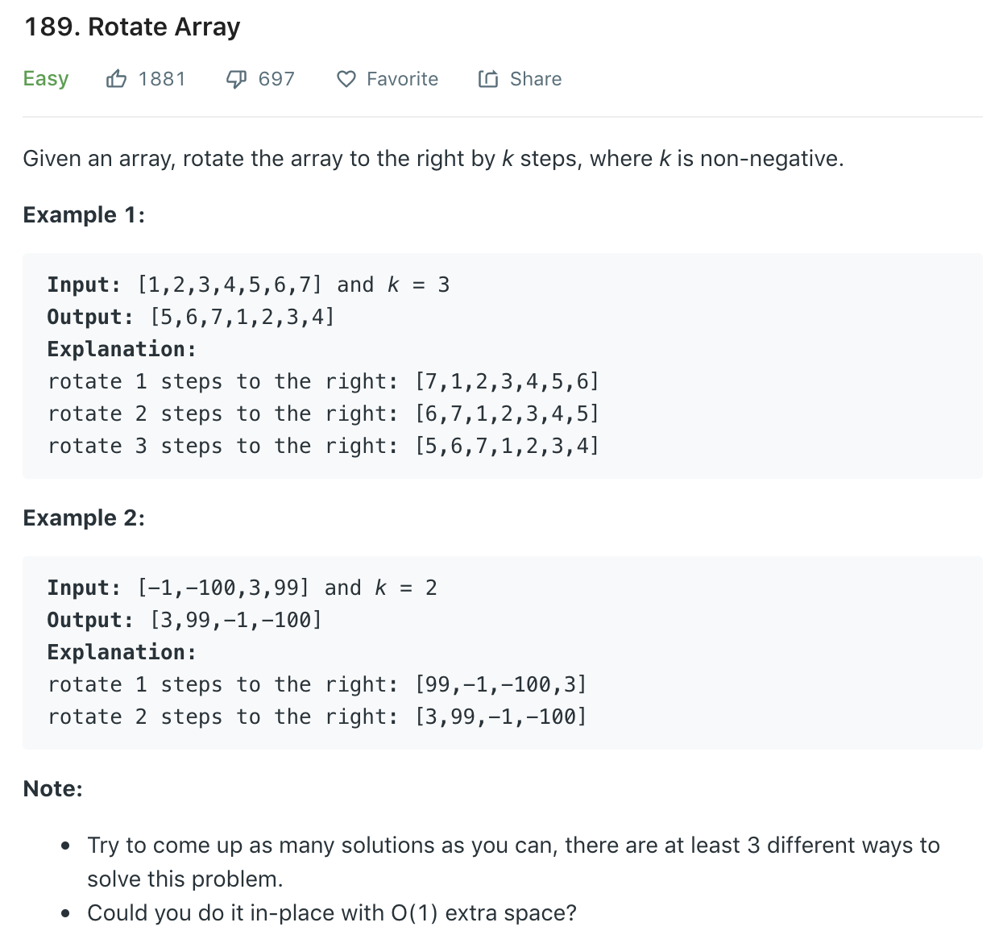

### Solution 1
[1, 2, 3, 4, 5, 6, 7] ->
[7, 6, 5, 4, 3, 2, 1] ->
[5, 6, 7 | 4, 3, 2, 1] ->
[5, 6, 7 | 1, 2, 3, 4]
```python
def rotate(nums, k):
    """
    :type nums: List[int]
    :type k: int
    :rtype: None Do not return anything, modify nums in-place instead.
    """
    n = len(nums)
    k %= n
    
    def reverse(nums, l, r):
        while l < r:
            nums[l], nums[r] = nums[r], nums[l]
            l += 1
            r -= 1
    
    reverse(nums, 0, n - 1)
    reverse(nums, 0, k - 1)
    reverse(nums, k, n - 1)
```

### Soution 2
```python
class Solution:
    def rotate(self, nums: List[int], k: int) -> None:
        """
        Do not return anything, modify nums in-place instead.
        """
        n = len(nums)
        if n < 2: return
        
        k = k % n
        if k == 0: return
        nums[:] = nums[n-k:] + nums[:n-k]
```