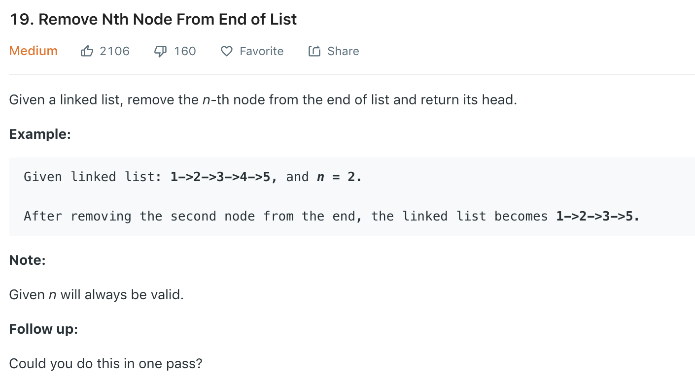

It's trivial to first get list length l, then move to the l - n th node. To do it in one-pass, we can use two pointers, the fast pointer is n nodes ahead of the slow pointer, when the fast pointer reaches the end, the slow pointer will be at the _n-th_ node from the end.
### Solution
```python
class Solution(object):
    def removeNthFromEnd(self, head, n):
        """
        :type head: ListNode
        :type n: int
        :rtype: ListNode
        """
        dummy = ListNode(0)
        dummy.next = head
        slow, fast = dummy, dummy
        
        for _ in range(n):
            fast = fast.next
            
        while fast.next:
            fast = fast.next
            slow = slow.next
            
        slow.next = slow.next.next
        return dummy.next
```