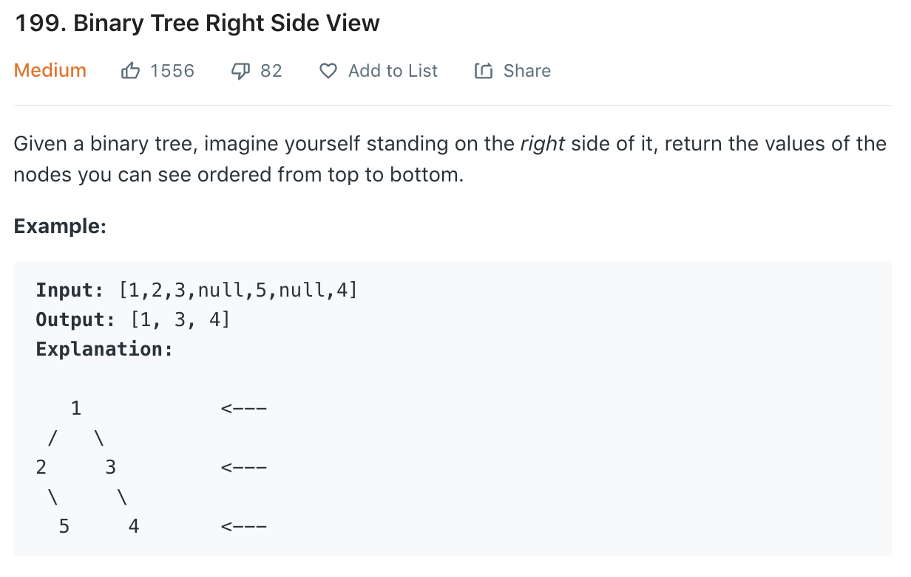

# Binary Tree Right Side View

### Solution 1 BFS
```python
class Solution(object):
    # BFS
    def rightSideView(self, root):
        """
        :type root: TreeNode
        :rtype: List[int]
        """
        if not root: return []

        queue = [root]
        right = []
        while queue:
            n = len(queue)
            for i in range(n):
                node = queue.pop(0)
                if node.left:
                    queue.append(node.left)
                if node.right:
                    queue.append(node.right)

                if i == n - 1:
                    right.append(node.val)

        return right
```
or
```python
def rightSideView(self, root: Optional[TreeNode]) -> List[int]:
    if not root: return []
    queue = [root]
    res = []
    lastNode = root
    while queue:
        cur = queue.pop(0)
        if cur.left:
            queue.append(cur.left)
        if cur.right:
            queue.append(cur.right)
        if cur is lastNode:
            res.append(cur.val)
            if queue:
                lastNode = queue[-1]
    return res
```
### Solution 2 DFS
Refer to [this](https://leetcode.com/problems/binary-tree-right-side-view/discuss/56012/My-simple-accepted-solution(JAVA)), visit right child first.
```python
def rightSideView(root):
    res = []
    def rightView(cur, res, curDepth):
        if not cur: return
        # res.size is the level we are waiting at
        # res.sizw == 0, waiting for the first node at level 0
        # res.size == 1, waiting for the first node at level 1
        # res.size == 2, waiting for the first node at level 2
        if curDepth == len(res):
            res.append(cur.val)

        rightView(cur.right, res, curDepth + 1)
        rightView(cur.left, res, curDepth + 1)

    rightView(root, res, 0)
    return res
```
or
To see the right side of a tree, at each depth we only care about the first node we encounter when looking from the right.

If we perform DFS by visiting:
1. Right child first, then
3. Left child
…then the first node we reach at every depth is the visible right-side node.
We store that node the moment we first reach that depth.

Algorithm
1. Create an empty list res to store the right-side values.
2. Define a dfs function that takes a node and its depth.
3. In the dfs:
   * If the node is null → return.
   * If depth == len(res) → this is the first node at this depth → append its value.
* Recursively visit the right child first.
* Then recursively visit the left child.
1. Start dfs from the root at depth 0.
2. Return res.
```python
def rightSideView(root: Optional[TreeNode]) -> List[int]:
    res = []
    if not root: return res
    def dfs(level, node):
        if len(res) <= level:
            res.append(node.val)
        if node.right:
            dfs(level + 1, node.right)
        if node.left:
            dfs(level + 1, node.left)
    dfs(0, root)
    return res
```