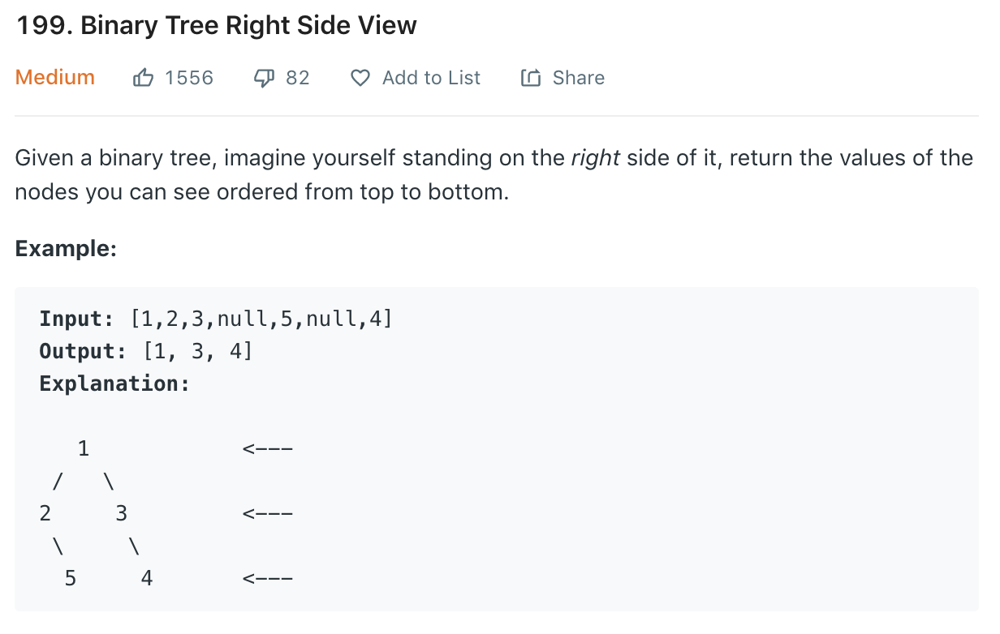

### Solution 1 BFS
```python
class Solution(object):
    # BFS
    def rightSideView(self, root):
        """
        :type root: TreeNode
        :rtype: List[int]
        """
        if not root: return []

        queue = [root]
        right = []
        while queue:
            n = len(queue)
            for i in range(n):
                node = queue.pop(0)
                if node.left:
                    queue.append(node.left)
                if node.right:
                    queue.append(node.right)

                if i == n - 1:
                    right.append(node.val)

        return right
```

### Solution 2 DFS
Refer to [this](https://leetcode.com/problems/binary-tree-right-side-view/discuss/56012/My-simple-accepted-solution(JAVA)), visit right child first.
```python
def rightSideView(root):
    res = []
    def rightView(cur, res, curDepth):
        if not cur: return
        # res.size is the level we are waiting at
        # res.sizw == 0, waiting for the first node at level 0
        # res.size == 1, waiting for the first node at level 1
        # res.size == 2, waiting for the first node at level 2
        if curDepth == len(res):
            res.append(cur.val)

        rightView(cur.right, res, curDepth + 1)
        rightView(cur.left, res, curDepth + 1)

    rightView(root, res, 0)
    return res
```