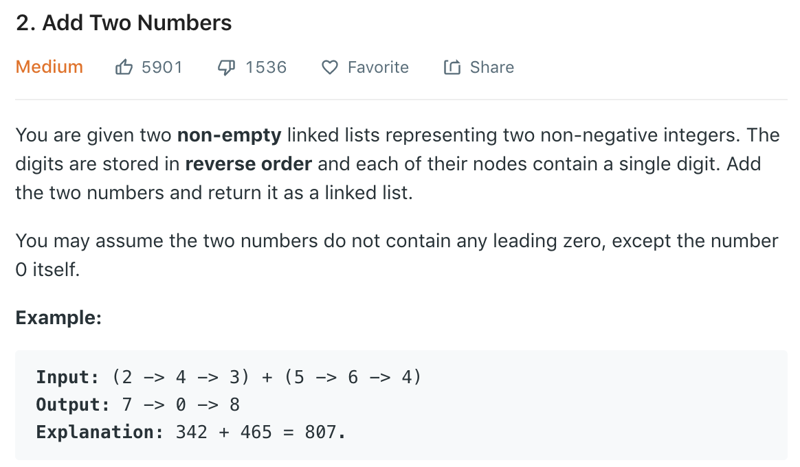

## Add Two Numbers

### Solution
```python
class Solution(object):
    def addTwoNumbers(self, l1, l2):
        """
        :type l1: ListNode
        :type l2: ListNode
        :rtype: ListNode
        """
        res = ListNode(0)
        head = res
        carry = 0
        
        while l1 and l2:
            add = l1.val + l2.val + carry
            head.next = ListNode(add % 10)
            carry = add // 10
            
            l1 = l1.next
            l2 = l2.next
            head = head.next
        
        while l1:
            if carry:
                add = l1.val + carry
                head.next = ListNode(add % 10)
                carry = add // 10
            else:
                head.next = l1
                break
            l1 = l1.next
            head = head.next
           
        while l2:
            if carry:
                add = l2.val + carry
                head.next = ListNode(add % 10)
                carry = add // 10
            else:
                head.next = l2
                break
            l2 = l2.next
            head = head.next
        
        if carry:
            head.next = ListNode(carry)
        
        return res.next
```
or
```python
def addTwoNumbers(self, l1: Optional[ListNode], l2: Optional[ListNode]) -> Optional[ListNode]:
    if not l1: return l2
    if not l2: return l1
    carry = 0
    head = ListNode(None)
    cur = head
    while l1 or l2 or carry:
        if l1:
            carry += l1.val
            l1 = l1.next
        if l2:
            carry += l2.val
            l2 = l2.next
        cur.next = ListNode(carry % 10)
        carry = carry // 10
        cur = cur.next
    return head.next
```