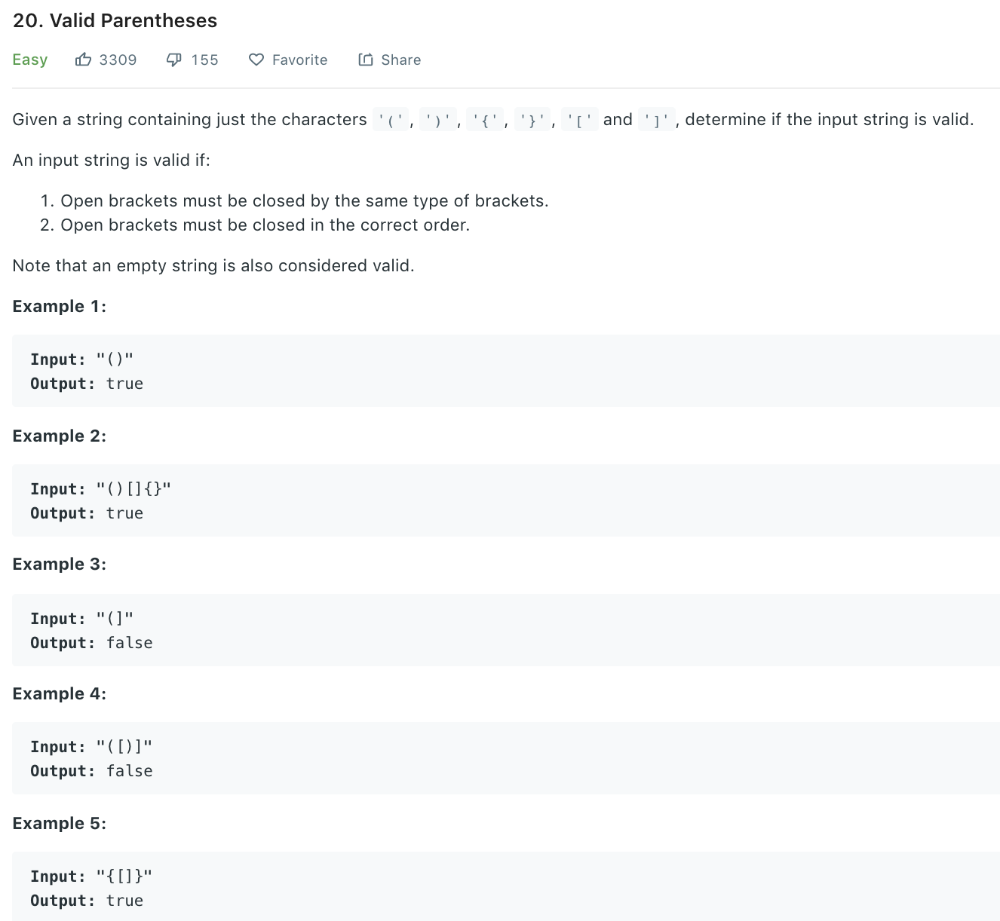

### Solution
```python
class Solution(object):
    def isValid(self, s):
        """
        :type s: str
        :rtype: bool
        """
        stack = []
        map = {'(': ')',  '[':']', '{': '}'}
        for p in s:
        # meet left parenthesis, push stack
            if p in map:
                stack.append(p)
        # right parenthese do not have matching left parenthese on stack top
            elif (not stack) or map[stack.pop()] != p:
                return False
        
        return len(stack) == 0
```
```python
class Solution(object):
    def isValid(self, s):
        d = {')':'(','}':'{',']':'['}
        stack = [1]
        for e in s:
            if e in d:
                if stack.pop() != d[e]:
                    return False
            else:
                stack.append(e)
        return len(stack) ==1
```