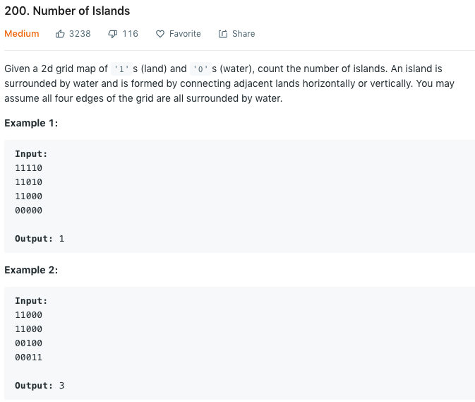

### Solution DFS
```python
class Solution(object):
    def numIsLands(self, grid):
        count = 0

        m, n = len(grid), len(grid[0])
        for i in range(m):
            for j in range(n):
                if grid[i][j] == '1':
                    # found an island
                    count += 1
                    self.dfs(grid, i, j)

        return count
    
    # mark the whole island where (i, j) is in as visited
    def dfs(self, grid, i, j):
        if i < 0 or i >= len(grid) or j < 0 or j >= len(grid[0]):
            return

        if grid[i][j] == '1':
            # mark this cell as visited
            grid[i][j] = '#'
            self.dfs(grid, i + 1, j)
            self.dfs(grid, i - 1, j)
            self.dfs(grid, i, j + 1)
            self.dfs(grid, i, j - 1)
```