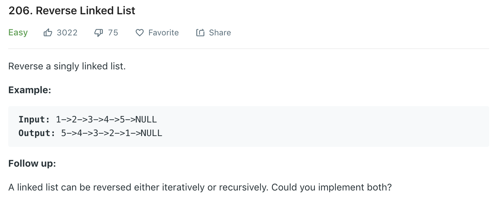

### Solution 1 Iteration
```python
class Solution(object):
    def reverseList(self, head):
        """
        :type head: ListNode
        :rtype: ListNode
        """
        if not head or not head.next:
            return head
        
        prev, cur = None, head
        while cur:
            nex = cur.next
            cur.next = prev
            prev = cur
            cur = nex
        
        return prev
```

### Solution 2 Recusion
```python
def reverseList(head):
    if not head or not head.next:
        return head

    nex = head.next
    head.next = None
    
    tmp = reverseList(nex)
    nex.next = head
    
    return tmp
    
```