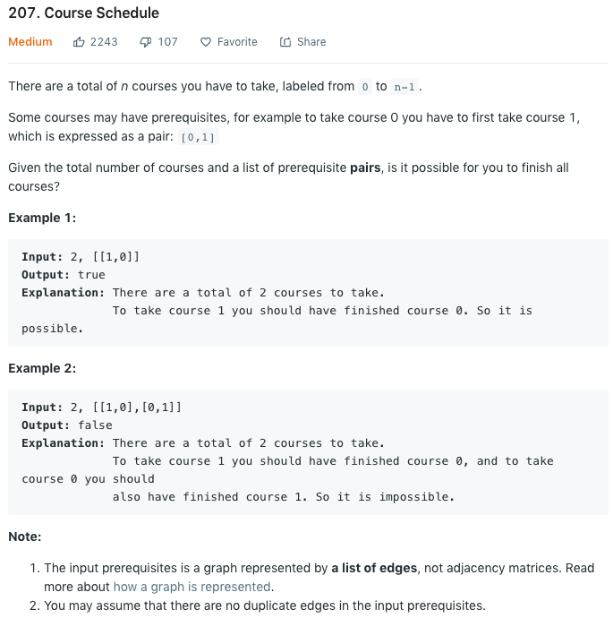

### Solution

```python
class Solution(object):
    def canFinish(self, numCourses, prerequisites):
        """
        :type numCourses: int
        :type prerequisites: List[List[int]]
        :rtype: bool
        """
        visited = [False] * numCourses
        recStack = [False] * numCourses

        edge = collections.defaultdict(set)
        for pre in prerequisites:
            edge[pre[1]].add(pre[0])

        for node in range(numCourses):
            if visited[node] is False:
                if self.hasCycle(node, edge, visited, recStack):
                    return False
        return True


    def hasCycle(self, node, edge, visited, recStack):
        visited[node] = True
        recStack[node] = True

        for nbr in edge[node]:
            if not visited[nbr]:
                if self.hasCycle(nbr, edge, visited, recStack):
                    return True
            elif recStack[nbr]:
                return True
        
        recStack[node] = False
        return False

```