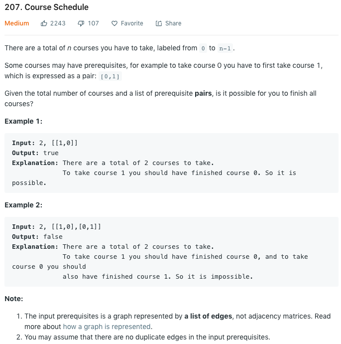

# Course Schedule

### Solution 1 DFS
```python
class Solution(object):
    def canFinish(self, numCourses, prerequisites):
        """
        :type numCourses: int
        :type prerequisites: List[List[int]]
        :rtype: bool
        """
        visited = [False] * numCourses
        recStack = [False] * numCourses

        edge = collections.defaultdict(set)
        for pre in prerequisites:
            edge[pre[1]].add(pre[0])

        for node in range(numCourses):
            if visited[node] is False:
                if self.hasCycle(node, edge, visited, recStack):
                    return False
        return True


    def hasCycle(self, node, edge, visited, recStack):
        visited[node] = True
        recStack[node] = True

        for nbr in edge[node]:
            if not visited[nbr]:
                if self.hasCycle(nbr, edge, visited, recStack):
                    return True
            elif recStack[nbr]:
                return True
        
        recStack[node] = False
        return False
```
or
```python
class Solution:
    def canFinish(self, numCourses: int, prerequisites: List[List[int]]) -> bool:
        childCourses = dict()
        for c, pc in prerequisites:
            if pc not in childCourses:
                childCourses[pc] = [c]
            else:
                childCourses[pc].append(c)
        
        onStack = set()
        visited = set()
        # return True if can traverse without cycle
        def dfs(course):
            if course in onStack:
                return False
            if course in visited:
                return True
            onStack.add(course)
            visited.add(course)
            for nbr in childCourses.get(course, []):
                if not dfs(nbr):
                    return False
            onStack.remove(course)
            return True
        for c in range(numCourses):
            if not dfs(c):
                return False
        return True
```

### Solution 2 BFS
```python
class Solution:
    def canFinish(self, numCourses: int, prerequisites: List[List[int]]) -> bool:
        courseReq = dict()
        nextCourses = dict()

        for pre in prerequisites:
            courseReq[pre[0]] = courseReq.get(pre[0], 0) + 1
            if pre[1] not in nextCourses:
                nextCourses[pre[1]] = [pre[0]]
            else:
                nextCourses[pre[1]].append(pre[0])
        
        readyCourses = [c for c in range(numCourses) if c not in courseReq]

        cnt = 0
        while readyCourses:
            c = readyCourses.pop(0)
            cnt += 1
            for nxt in nextCourses.get(c, []):
                courseReq[nxt] -= 1
                if courseReq[nxt] == 0:
                    readyCourses.append(nxt)
        
        return cnt == numCourses
```