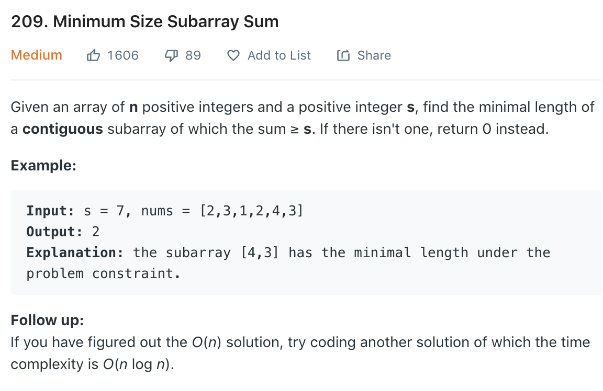

### Solution
sliding window
```python
class Solution(object):
    def minSubArrayLen(self, s, nums):
        """
        :type s: int
        :type nums: List[int]
        :rtype: int
        """
        i = 0
        windowSum = 0
        minLen = len(nums) + 1

        for j in range(len(nums)):
            windowSum += nums[j]
            while windowSum >= s:
                minLen = min(minLen, j - i + 1)
                windowSum -= nums[i]
                i += 1

        if minLen > len(nums):
            return 0
        else:
            return minLen
```