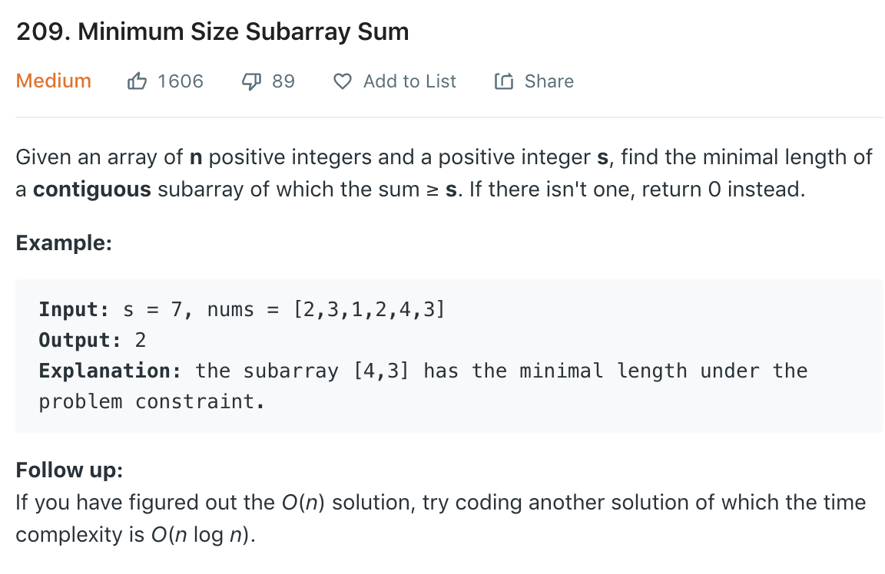

### Solution 1
sliding window
我们注意到，数组 中的元素均为正整数，我们可以考虑使用双指针来维护一个滑动窗口。

具体地，我们定义两个指针l, r分别表示滑动窗口的左边界和右边界，用一个变量s代表滑动窗口中的元素和。在每一步操作中，我们移动右指针r使得滑动窗口中加入一个元素，如果此时s >= target我们就更新最小长度ans = min(ans, r - l + 1并将左指针l循环向右移动，直至有s < target。 最后，如果最小长度ans 仍为初始值，我们就返回0, 否则返回ans。

time complexity: O(n), space: O(1)
```python
class Solution(object):
    def minSubArrayLen(self, s, nums):
        """
        :type s: int
        :type nums: List[int]
        :rtype: int
        """
        i = 0
        windowSum = 0
        minLen = len(nums) + 1

        for j in range(len(nums)):
            windowSum += nums[j]
            while windowSum >= s:
                minLen = min(minLen, j - i + 1)
                windowSum -= nums[i]
                i += 1

        if minLen > len(nums):
            return 0
        else:
            return minLen
```
or
```python
def minSubArrayLen(self, target: int, nums: List[int]) -> int:
    minLen = len(nums) + 1
    start = 0
    curSum = 0
    for j in range(len(nums)):
        curSum += nums[j]
        if curSum >= target:
            minLen = min(minLen, j - start + 1)

        while curSum - nums[start] >= target:
            curSum -= nums[start]
            start += 1
            minLen = min(minLen, j - start + 1)

    return minLen if minLen <= len(nums) else 0
```

### Solution 2
Prefix + Binary Search 
我们先预处理出数组nums的前缀和数组s, 其中s[i]表示数组nums前i项元素之和。由于数组nums中的元素都是正整数，因此数组s也是单调递增的。另外，我们初始化答案ans=n+1。

接下来，我们遍历前缀和数组s, 对于其中的每个元素s[i]我们可以通过二分查找的方法找到满足s[j] >= s[i]+target的最小下标j, 如果j <= n, 则说明存在满足条件的子数组，我们可以更新答案，即ans = min(ans, j-i).

最后，如果ans <= n, 则说明存在满足条件的子数组...
Time complexity: O(nlogn), space complexity: O(n)

```python
class Solution:
    def minSubArrayLen(self, target: int, nums: List[int]) -> int:
        n = len(nums)
        s = list(accumulate(nums, initial=0))
        ans = n + 1
        for i, x in enumerate(s):
            j = bisect_left(s, x + target)
            if j <= n:
                ans = min(ans, j - i)
        return ans if ans <= n else 0
```