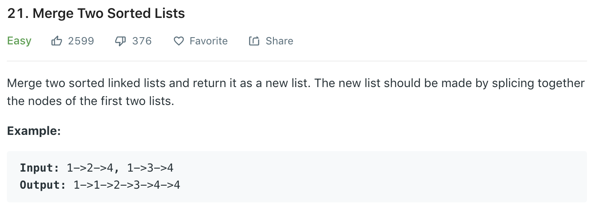

### Solution
```python
class Solution(object):
    def mergeTwoLists(self, l1, l2):
        """
        :type l1: ListNode
        :type l2: ListNode
        :rtype: ListNode
        """
        dummy = ListNode(0)
        head = dummy
        while l1 and l2:
            if l1.val <= l2.val:
                head.next = l1
                l1 = l1.next
            else:
                head.next = l2
                l2 = l2.next
            head = head.next
        
        if l1:
            head.next = l1
        
        if l2:
            head.next = l2
        
        return dummy.next
```