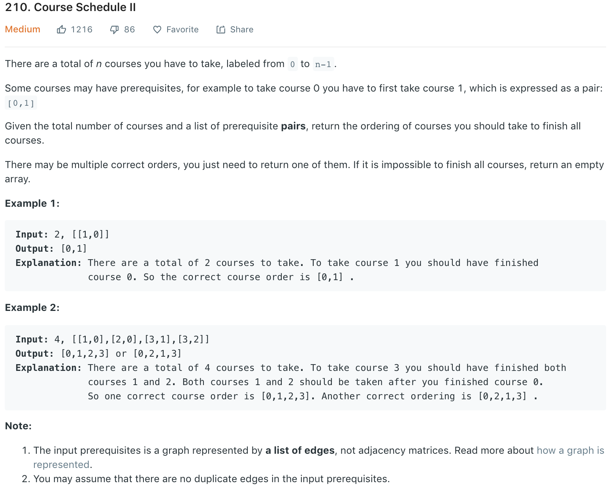

**Topological sort**<br>
### Solution 1 BFS
if a node has incoming edges, it has prerequisites. Therefore, the first few in the order must be those with no prerequisites, i.e. no incoming edges. Any non-empty DAG must have at least one node without incoming links. You can draw a small graph to convince yourself. If we visit these few and remove all edges attached to them, we are left with a smaller DAG, which is the same problem. This will then give our _BFS_ solution.
```python
class Solution:
    def findOrder(self, numCourses, prerequisites):
        """
        :type numCourses: int
        :type prerequisites: List[List[int]]
        :rtype: List[int]
        """
        # to
        toNode = collections.defaultdict(set)
        # from, i.e., adjacency list (not matrix as it is likely to be sparse)
        fromNode = collections.defaultdict(set)
        for i, j in prerequisites:
            toNode[i].add(j)
            fromNode[j].add(i)
        # courses that has no prerequisites are ready to take
        readyToTake = [i for i in range(numCourses) if not toNode[i]]
        res = []
        while readyToTake:
            node = readyToTake.pop()
            res.append(node)
            for i in fromNode[node]:
                toNode[i].remove(node)
                if not toNode[i]:
                    readyToTake.append(i)
            toNode.pop(node)
        return res if not toNode else []
```
Optimization: actually, we donot need set *toNode* to sotre all prerequisites of a course, we only need to count the number of prerequisites that haven't been taken.
```python
def findOrder(self, numCourses, prerequisites):
    # toNode = collections.defaultdict(set)
    toNode = [0] * numCourses
    fromNode = collections.defaultdict(set)
    for i, j in prerequisites:
        # toNode[i].add(j)
        toNode[i] += 1
        fromNode[j].add(i)
    # queue
    readyToTake = [course for course in range(numCourses) if not toNode[course]]
    order = []
    
    while readyToTake:
        node = readyToTake.pop(0)
        order.append(node)
        for i in fromNode[node]:
            # toNode[i].remove(node)
            toNode[i] -= 1
            if not toNode[i]:
                readyToTake.append(i)
    
    if len(order) == numCourses:
        return order
    else:
        return []
```
### Solution 2 DFS
Another way to think about it is the last few in the order must be those which are not prerequisites of other courses. Thinking it recursively means if one node has unvisited child node, you should visit them first before you put this node down in the final order array. This sounds like the post-order of a DFS. Since we are putting nodes down in the reverse order, we should reverse it back to correct ordering or use a stack.
NOTE: this is iterative dfs (not recursive), so we use _stack_ here instead of _queue_ in bfs.
```python
def findOrder(numCourses, prerequisites):
    dic = collections.defaultdict(set)
    neigh = collections.defaultdict(set)
    for i, j in prerequisites:
        dic[i].add(j)
        neigh[j].add(i)
    stack = [i for i in range(numCourses) if not dic[i]]
    res = []
    while stack:
        node = stack.pop()
        res.append(node)
        for i in neigh[node]:
            dic[i].remove(node)
            if not dic[i]:
                stack.append(i)
        dic.pop(node)
    return res if not dic else []
```