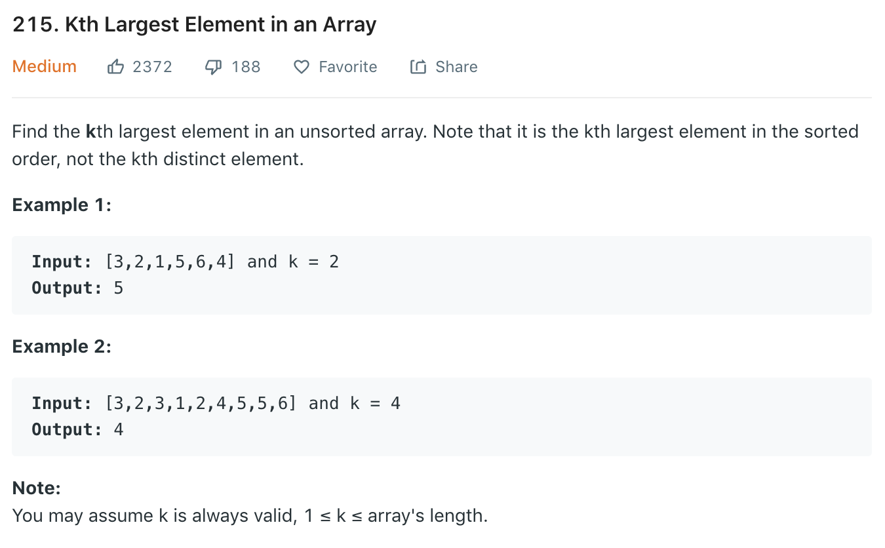

### Solution
```python
import heapq
class Solution(object):
    def findKthLargest(self, nums, k):
        """
        :type nums: List[int]
        :type k: int
        :rtype: int
        """
        h = []
        for i in range(k):
            heapq.heappush(h, nums[i])
        # or
        # h = nums[:k]
        # heapq.heapify(h)

        for i in range(k, len(nums)):
            if nums[i] > h[0]:
                heapq.heappop(h)
                heapq.heappush(h, nums[i])

        return h[0]
```