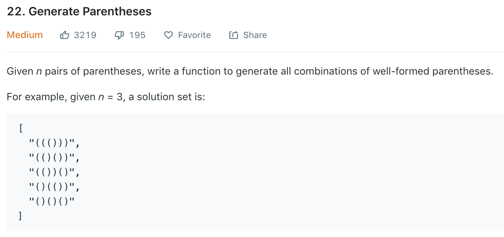

### Solution
```python
class Solution(object):
    def generateParenthesis(self, n):
        """
        :type n: int
        :rtype: List[str]
        """
        ret = []
        self.helper(0, 0, n, "", ret)
        return ret
    
    # l, r is the number of '(' and ')', l >= r 
    def helper(self, l, r, n, path, res):
        # get n '(', can only add ')'
        if l == n:
            res.append(path+')' * (n - r))
            return
        # get n '(' and n ')'
        if r == n:
            res.append(path)
            return
        if l > r:
            self.helper(l, r + 1, n, path+')', res )
        # l == r, add a '(', cannot add ')'
        self.helper(l+1, r, n, path+'(', res)
    
    def helper2(self, l, r, n, path, res):
        # invalid
        if l < r or l > n:
            return
        if l == n and r == n: # l + r == 2n
            res.append(path)
            return
        self.helper(l + 1, r, n, path + '(', res)
        self.helper(l, r + 1, n, path + ')', res)
```
or
```python
def generateParenthesis(self, n: int) -> List[str]:
    res = []

    def generate(cur, leftNum):
        # with both below conditions met, result here is bound to be valid
        if len(cur) == n*2:
            res.append(cur)
            return
        # left bracket cannot exceed n
        if leftNum < n:
            generate(cur+'(', leftNum + 1)
        # at any time left bracket must >= right bracket
        if leftNum > len(cur)-leftNum:
            generate(cur+')', leftNum)
    
    generate('', 0)
    return res
```
or
```python
def generateParenthesis(n: int) -> List[str]:
    res = []
    def dfs(cur, left, right):
        if left+right == n*2:
            res.append(cur)
            return
        if left > right:
            dfs(cur+")", left, right+1)
        if left < n:
            dfs(cur+"(", left+1, right)

    dfs("", 0, 0)
    return res
```