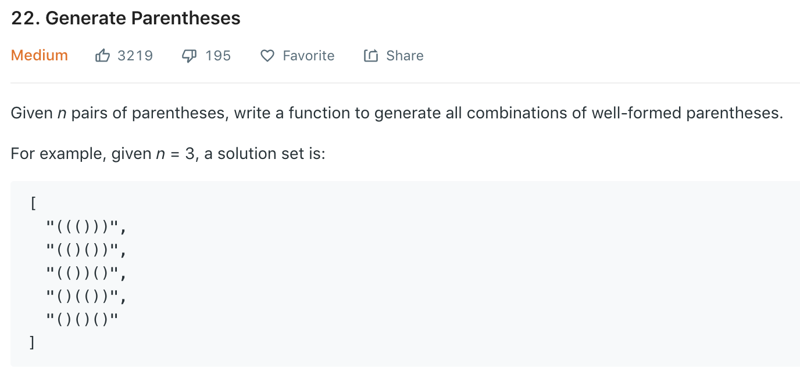

### Solution
```python
class Solution(object):
    def generateParenthesis(self, n):
        """
        :type n: int
        :rtype: List[str]
        """
        ret = []
        self.helper(0, 0, n, "", ret)
        return ret
    
    # l, r is the number of '(' and ')', l >= r 
    def helper(self, l, r, n, path, res):
        # get n '(', can only add ')'
        if l == n:
            res.append(path+')' * (n - r))
            return
        # get n '(' and n ')'
        if r == n:
            res.append(path)
            return
        if l > r:
            self.helper(l, r + 1, n, path+')', res )
        # l == r, add a '(', cannot add ')'
        self.helper(l+1, r, n, path+'(', res)
    
    def helper2(self, l, r, n, path, res):
        if l < r or l > n:
            return
        if l == n and r == n:
            res.append(path)
            return
        self.helper(l + 1, r, n, path + '(', res)
        self.helper(l, r + 1, n, path + ')', res)
```