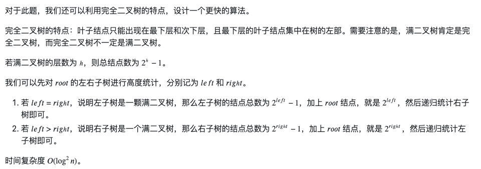

Count TreeNodes

### Solution O(N) - non-optimal
```python
class Solution:
    def countNodes(self, root: Optional[TreeNode]) -> int:
        self.cnt = 0
        def dfs(node):
            if not node: return
            self.cnt += 1
            dfs(node.left)
            dfs(node.right)
        dfs(root)
        return self.cnt
```
or
```python
class Solution:
    def countNodes(self, root: Optional[TreeNode]) -> int:
        if not root: return 0
        cnt = 0
        queue = [root]
        while queue:
            node = queue.pop(0)
            cnt += 1
            if node.left:
                queue.append(node.left)
            if node.right:
                queue.append(node.right)
        return cnt
```
### Solution O(Logn^2)
Binary search


#### Note
Something I found helpful. If you put a 1 at the top of a complete binary tree and all left legs are a 0 and all right legs are a 1 and then you follow a path it will build a number (in binary). That number will correspond to the count of the nodes in the tree if that path is the last node of a complete binary tree :) Using this it was trivial to construct a 'seek' function that took a node count number.