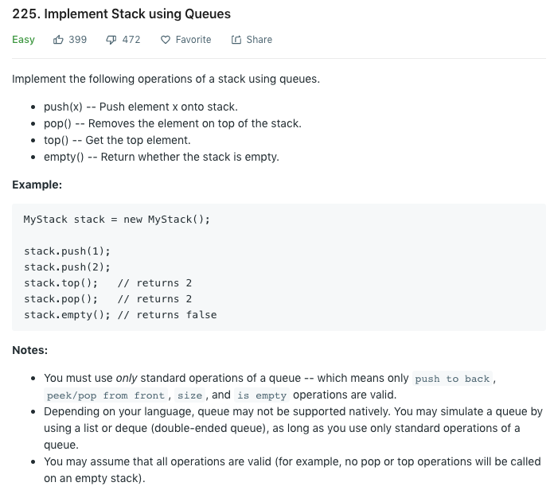

### Solution
```python
class MyStack(object):

    def __init__(self):
        """
        Initialize your data structure here.
        """
        self.queue = []

    def push(self, x):
        """
        Push element x onto stack.
        :type x: int
        :rtype: None
        """
        self.queue.append(x)
        for i in range(len(self.queue) - 1):
            self.queue.append(self.queue[0])
            self.queue.pop(0)

    def pop(self):
        """
        Removes the element on top of the stack and returns that element.
        :rtype: int
        """
        return self.queue.pop(0)

    def top(self):
        """
        Get the top element.
        :rtype: int
        """
        return self.queue[0]

    def empty(self):
        """
        Returns whether the stack is empty.
        :rtype: bool
        """
        return len(self.queue) == 0

# Your MyStack object will be instantiated and called as such:
# obj = MyStack()
# obj.push(x)
# param_2 = obj.pop()
# param_3 = obj.top()
# param_4 = obj.empty()
```