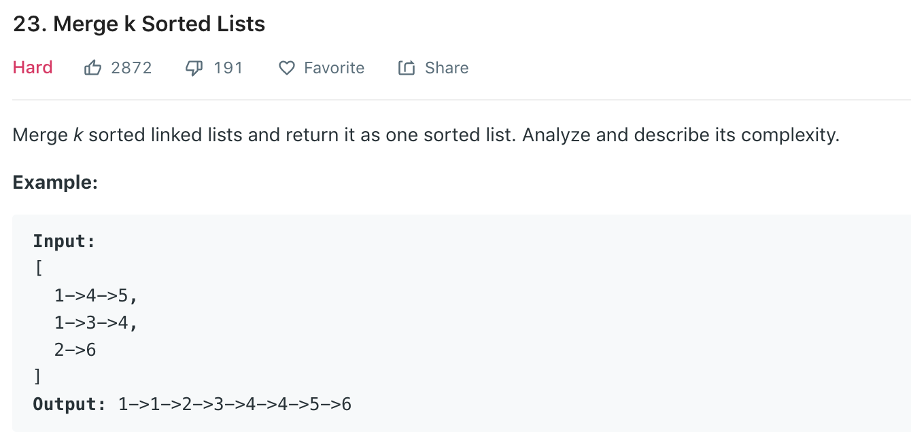

### Solution minHeap/Priority Queue
Use a minHeap to store the head of all lists. Continuously pop node from the heap (which is the current smallest nodes), then push node.next into the heap, until heap is empty. 
```python
class Solution(object):
    def mergeKLists(self, lists):
        """
        :type lists: List[ListNode]
        :rtype: ListNode
        """
        h = []
        for node in lists:
            if node != None:
                heapq.heappush(h, (node.val, node))
        
        dummy = ListNode(0)
        ptr = dummy
        
        while h:
            ptr.next = heapq.heappop(h)[1]
            ptr = ptr.next
            if ptr.next:
                heapq.heappush(h, (ptr.next.val, ptr.next))
        
        return dummy.next
```
### Solution 2 Iteration
Iteratively merge 2 lists until there is only one list.
```python
class Solution(object):
    def mergeKLists(self, lists):
        if not lists: return None
        
        while len(lists) > 1:
            l1 = lists.pop(0)
            l2 = lists.pop(0)
            lists.append(self.mergeTwo(l1, l2))
        
        return lists[0]
    
    def mergeTwo(self, l1, l2):
        dummy = ListNode(0)
        head = dummy
        while l1 and l2:
            if l1.val <= l2.val:
                head.next = l1
                l1 = l1.next
            else:
                head.next = l2
                l2 = l2.next
            head = head.next
        if l1:
            head.next = l1
        else:
            head.next = l2
        return dummy.next
```