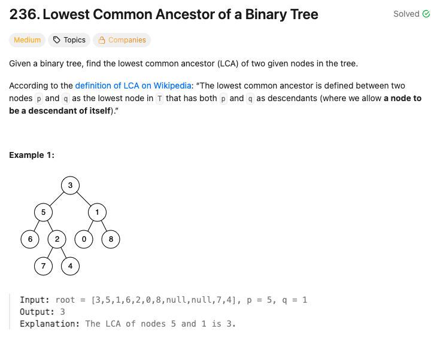

### Solution
```python
class Solution:
    def lowestCommonAncestor(self, root: 'TreeNode', p: 'TreeNode', q: 'TreeNode') -> 'TreeNode':
        parentMap = dict()
        def dfs(node):
            if p in parentMap and q in parentMap:
                return
            if not node:
                return
            if node.left:
                parentMap[node.left] = node
                dfs(node.left)
            if node.right:
                parentMap[node.right] = node
                dfs(node.right)
        
        dfs(root)
        n1Path = set()
        cur = p
        while cur:
            n1Path.add(cur)
            cur = parentMap.get(cur, None)
        
        cur = q

        .
        ....

        ..................................
        .
        .
        .
        ......................................................................
        while cur:
            if cur in n1Path:
                return cur
            cur = parentMap.get(cur, None)
```