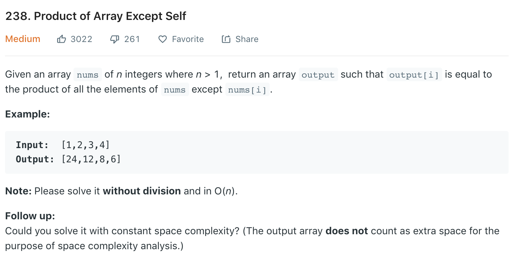

### Solution
```python
class Solution(object):
    def productExceptSelf(self, nums):
        """
        :type nums: List[int]
        :rtype: List[int]
        """
        res = [1] * len(nums)
        leftMul = 1
        for i in range(1, len(nums)):
            leftMul *= nums[i - 1]
            res[i] = leftMul

        rightMul = 1
        for j in reversed(range(len(nums) - 1)):
            rightMul *= nums[j + 1]
            res[j] *= rightMul

        return res
```