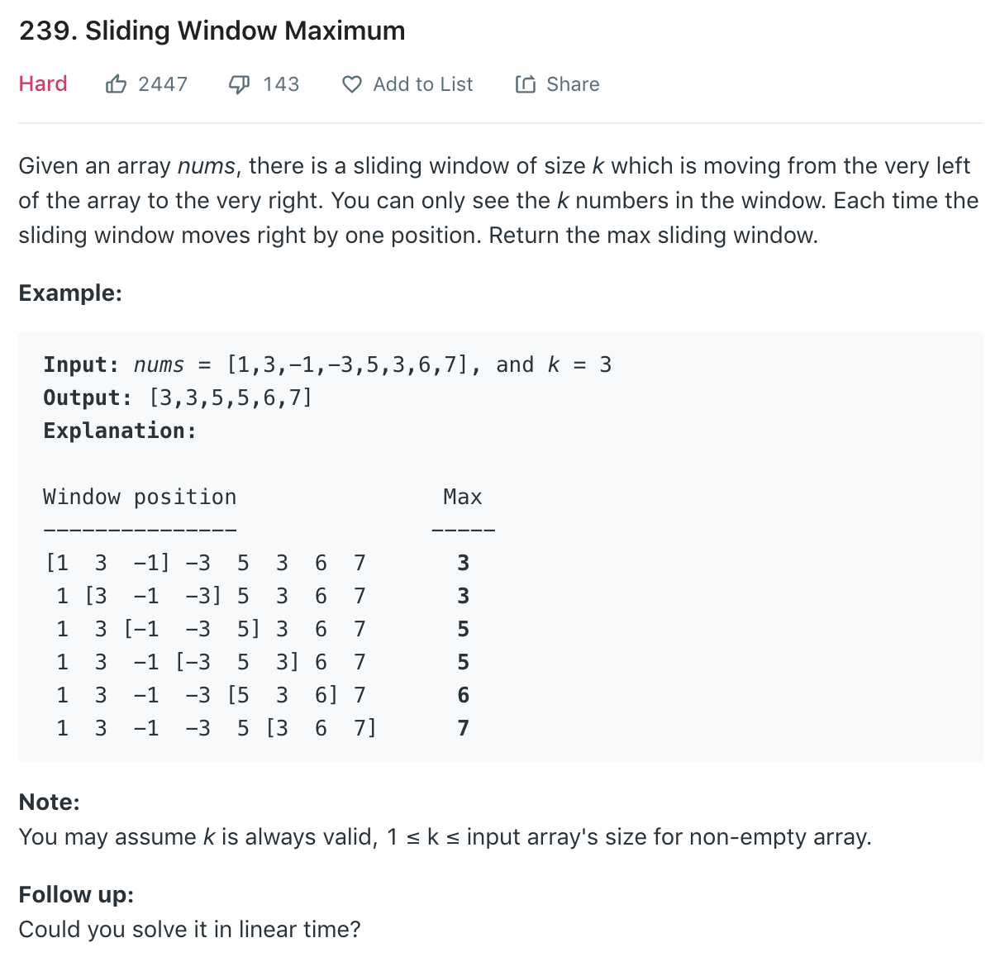

### Solution
Using deque, refer to [here](https://leetcode.com/problems/sliding-window-maximum/discuss/65884/Java-O(n)-solution-using-deque-with-explanation).

We scan the array from 0 to n-1, keep "promising" elements in the deque. The algorithm is amortized O(n) as each element is put and polled once.

At each i, we keep "promising" elements, which are potentially max number in window [i-(k-1),i] or any subsequent window. This means

1. If an element in the deque and it is out of i-(k-1), we discard them. We just need to poll from the head, as we are using a deque and elements are ordered as the sequence in the array

2. Now only those elements within [i-(k-1),i] are in the deque. We then discard elements smaller than a[i] from the tail. This is because if a[x] < a[i] and x<i, then a[x] has no chance to be the max in [i-(k-1),i], or any other subsequent window: a[i] would always be a better candidate.

3. As a result elements in the deque are ordered in both sequence in array and their value. At each step the head of the deque is the max element in [i-(k-1),i]
```python
class Solution(object):
    def maxSlidingWindow(self, A, k):
        """
        :type nums: List[int]
        :type k: int
        :rtype: List[int]
        """
        if not A or k <= 0: return []

        n = len(A)
        res = []
        # store index
        dq = []

        for i in range(n):
            #remove nums out of range k
            if dq and dq[0] < i-k+1:
                dq.pop(0)
            # remove impossible candidate
            while dq and A[dq[-1]] < A[i]:
                dq.pop()
            dq.append(i)
            if i-k+1 >= 0:
                res.append(A[dq[0]])

        return res
```