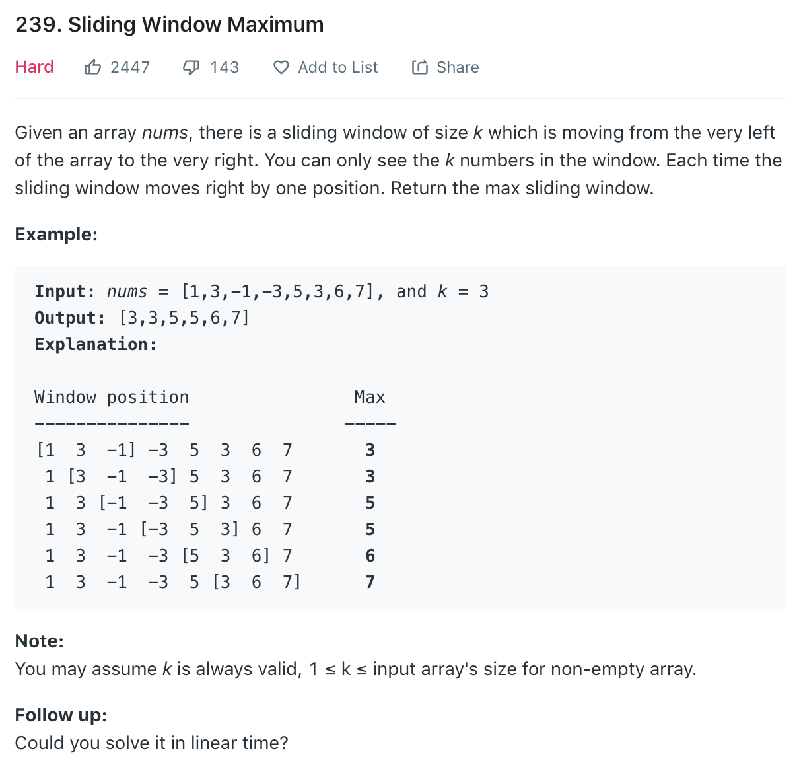

# Sliding Window Maximum

### Solution
Using deque, refer to [here](https://leetcode.com/problems/sliding-window-maximum/discuss/65884/Java-O(n)-solution-using-deque-with-explanation).

We scan the array from 0 to n-1, keep "promising" elements in the deque. The algorithm is amortized O(n) as each element is put and polled once.

At each i, we keep "promising" elements, which are potentially max number in window [i-(k-1),i] or any subsequent window. This means

1. If an element in the deque and it is out of i-(k-1), we discard them. We just need to poll from the head, as we are using a deque and elements are ordered as the sequence in the array

2. Now only those elements within [i-(k-1),i] are in the deque. We then discard elements smaller than a[i] from the tail. This is because if a[x] < a[i] and x<i, then a[x] has no chance to be the max in [i-(k-1),i], or any other subsequent window: a[i] would always be a better candidate.

3. As a result elements in the deque are ordered in both sequence in array and their value. At each step the head of the deque is the max element in [i-(k-1),i]
```python
class Solution(object):
    def maxSlidingWindow(self, A, k):
        """
        :type nums: List[int]
        :type k: int
        :rtype: List[int]
        """
        if not A or k <= 0: return []

        n = len(A)
        res = []
        # store index
        dq = []

        for i in range(n):
            #remove nums out of range k
            if dq and dq[0] < i-k+1:
                dq.pop(0)
            # remove impossible candidate
            while dq and A[dq[-1]] < A[i]:
                dq.pop()
            dq.append(i)
            if i-k+1 >= 0:
                res.append(A[dq[0]])

        return res
```

or
这道题是 滑动窗口 + 双端队列 (Deque) 的经典结合，也是面试中考察“单调栈/单调队列”思想的高频题。

1. 核心挑战
在一个长度为 k 的窗口移动时，如果我们每次都用 max() 去找最大值，时间复杂度是 O(N⋅k)。在 N 很大的情况下会超时。

我们需要一种数据结构，能够：

快速获取当前窗口最大值。

在窗口滑动时，高效地添加新元素并移除过期元素。

2. 秘密武器：单调双端队列 (Monotonic Deque)
我们维护一个 deque，它里面存储的是元素的索引，并且保持队列中的元素对应的值是严格单调递减的。

为什么存索引？
存索引可以让我们轻松判断队列头部的元素是否已经“过期”（即超出了窗口左边界）。

核心规则（重点）：
新元素入队前（淘汰弱者）：如果新来的数 nums[i] 比队尾的数大，那么队尾的数永远不可能成为最大值了（因为新数更强且更晚过期）。直接弹出队尾，直到队尾比新数大。

窗口滑动时（清理过期）：如果队首的索引已经小于 i - k + 1，说明它已经不在窗口内了，弹出队首。

最大值在哪？：因为队列是单调递减的，队首（front）永远是当前窗口的最大值。
```python
from collections import deque

class Solution:
    def maxSlidingWindow(self, nums: List[int], k: int) -> List[int]:
        dq = deque() # 存储索引
        res = []
        
        for i, num in enumerate(nums):
            # 1. 保持单调递减：如果当前数比队尾大，队尾就没用了
            while dq and nums[dq[-1]] < num:
                dq.pop()
            
            # 2. 将当前索引加入队尾
            dq.append(i)
            
            # 3. 检查队首是否过期（不在窗口范围 [i-k+1, i] 内）
            if dq[0] == i - k:
                dq.popleft()
            
            # 4. 当窗口形成（i >= k-1）时，记录答案
            if i >= k - 1:
                res.append(nums[dq[0]])
                
        return res
```