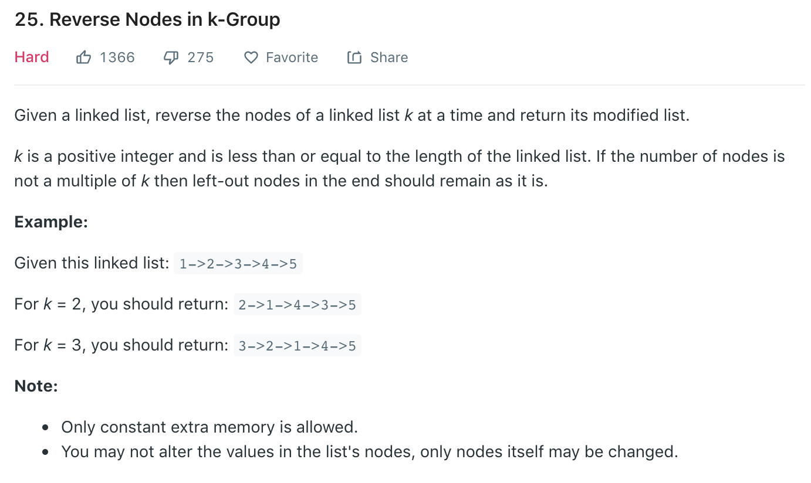

### Solution
Similar to [24](24.md).
```python
class Solution(object):
    def reverseKGroup(self, head, k):
        """
        :type head: ListNode
        :type k: int
        :rtype: ListNode
        """
        if not head or k == 1: return head
#     if less than k nodes, return head
        ptr = head
        for _ in range(k - 1):
            ptr = ptr.next
            if not ptr:
                return head  
#      reverse first k nodes
        p, c = None, head
        for _ in range(k):
            n = c.next
            c.next = p
            p = c
            c = n
            
        head.next = self.reverseKGroup(c, k)
        return p
```