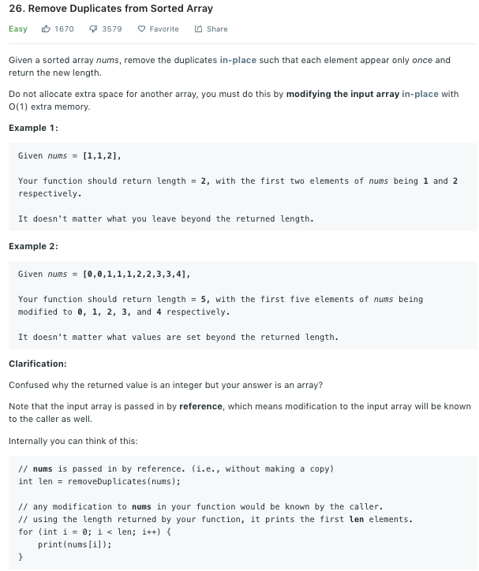

### Solution 1
Refer to [Solution](https://leetcode.com/problems/remove-duplicates-from-sorted-array/solution/).
We use 2 pointers, **slow** starts from 0 and points to the current end of *unique* array,  **fast** starts from 1 and points to the current end of original array. If nums[slow] == nums[fast], fast++; Otherwise, slow++ to store the current value fast is pointing to
```python
class Solution(object):
    def removeDuplicates(self, nums):
        """
        :type nums: List[int]
        :rtype: int
        """
        # slow, fast = 0, 1
        # while fast < len(nums):
        #     if nums[fast] != nums[slow]:
        #         slow += 1
        #         nums[slow] = nums[fast]
        #     fast += 1
        slow = 0
        for fast in range(1, len(nums)):
            if nums[fast] != nums[slow]:
                slow += 1
                nums[slow] = nums[fast]

        return slow + 1
```
### Solution 2
During iteration, we use dupCount to record the how many duplicate numbers we have.
```python
class Solution(object):
    def removeDuplicates(self, nums):
        dupCount = 0
        for i in range(len(nums)):
            if i > 0 and nums[i] == nums[i - 1]:
                dupCount += 1
            else:
                nums[i - dupCount] = nums[i]
        
        return len(nums) - dupCount
```

+ Time complexity: O(n)
+ Space complexity: O(1)