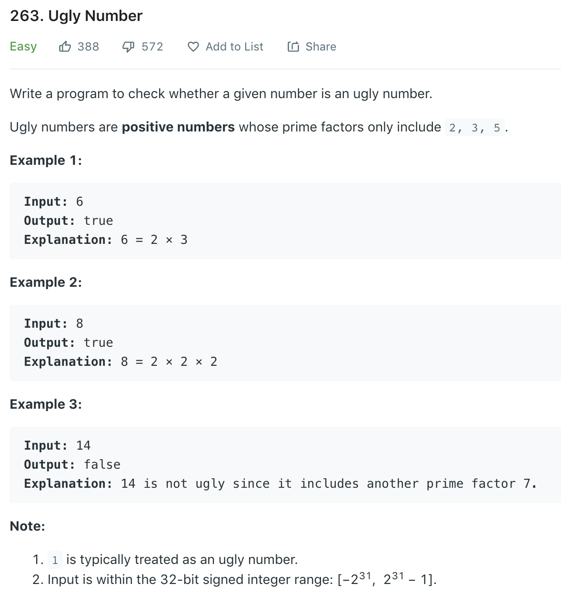

### Sol 1 Iteration
```python
class Solution(object):
    def isUgly(self, num):
        """
        :type num: int
        :rtype: bool
        """
        if num <= 0: return False
        while num != 1:
            if num % 2 == 0: num /= 2
            elif num % 3 == 0: num /= 3
            elif num % 5 == 0: num /= 5
            else: return False
        
        return True
```
or
```python
def isUgly(self, num):
    if num <= 0: return False
    while num % 2 == 0: num /= 2
    while num % 3 == 0: num /= 3
    while num % 5 == 0: num /= 5
    
    return num == 1
```
### Sol 2 Recursion
```python
class Solution(object):
    def isUgly(self, num):
        if num <= 0: return False
        if num % 2 == 0: return self.isUgly(num/2)
        if num % 3 == 0: return self.isUgly(num/3)
        if num % 5 == 0: return self.isUgly(num/5)
        
        return num == 1
```