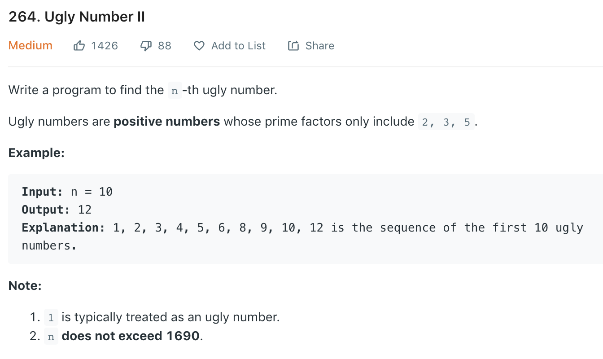

refer to [here](https://leetcode-cn.com/problems/chou-shu-lcof/solution/mian-shi-ti-49-chou-shu-dong-tai-gui-hua-qing-xi-t/) and [here](https://leetcode.wang/leetcode-264-Ugly-NumberII.html).

Inspired by [204](204.md), all ugly number are generated by previous ugly numbers * 2/3/5.
```python
class Solution(object):
    def nthUglyNumber(self, n):
        """
        :type n: int
        :rtype: int
        """
        dp = [1]*n
        # a/b/c: pos of previous ugly number that is multiplied by factor 2/3/5
        a, b, c = 0, 0, 0
        for i in range(1, n):
            n2, n3, n5 = dp[a]*2, dp[b]*3, dp[c]*5
            dp[i] = min(n2, n3, n5)
            if dp[i] == n2: a += 1
            if dp[i] == n3: b += 1
            if dp[i] == n5: c += 1
        
        return dp[-1]
```