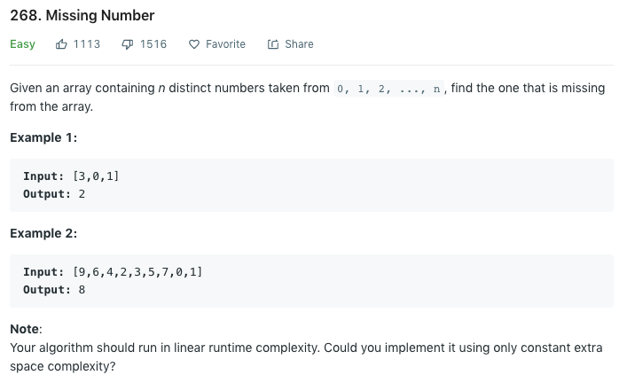

### Solution 1 XOR
```python
class Solution(object):
    def missingNumber(self, nums):
        """
        :type nums: List[int]
        :rtype: int
        """
        missing = len(nums)
        for i, num in enumerate(nums):
            missing ^= i ^ num

        return missing
```

### Solution 2
```python
def missingNum(nums):
    nums.append(-1)
    n = len(nums)
    for i in range(n):
        # iteratively put each number to the place it should be 
        cur = nums[i]
        while nums[cur] != cur:
            next = nums[cur]
            nums[cur] = cur
            if next == -1:
                break
            cur = next

    # in the end, the first number that is not on the right place is the missing number
    for i in range(n):
        if nums[i] != i:
            return i
```

### Solution 3
```python
def missingNumber(nums):
    s = set(nums)
    for i in range(len(nums) + 1):
        if i not in s:
            return i
```