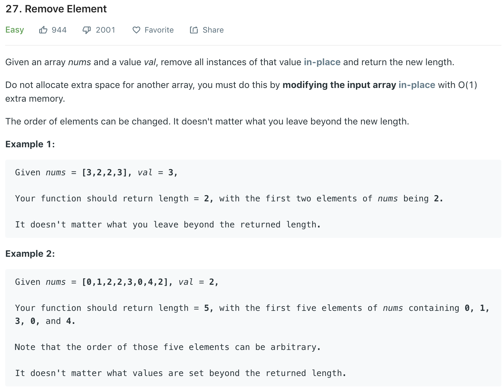

### Solution
```python
class Solution(object):
    def removeElement(self, nums, val):
        """
        :type nums: List[int]
        :type val: int
        :rtype: int
        """
        end = 0
        for j in range(len(nums)):
            if nums[j] != val:
                nums[end] = nums[j]
                end += 1
        
        return end
```