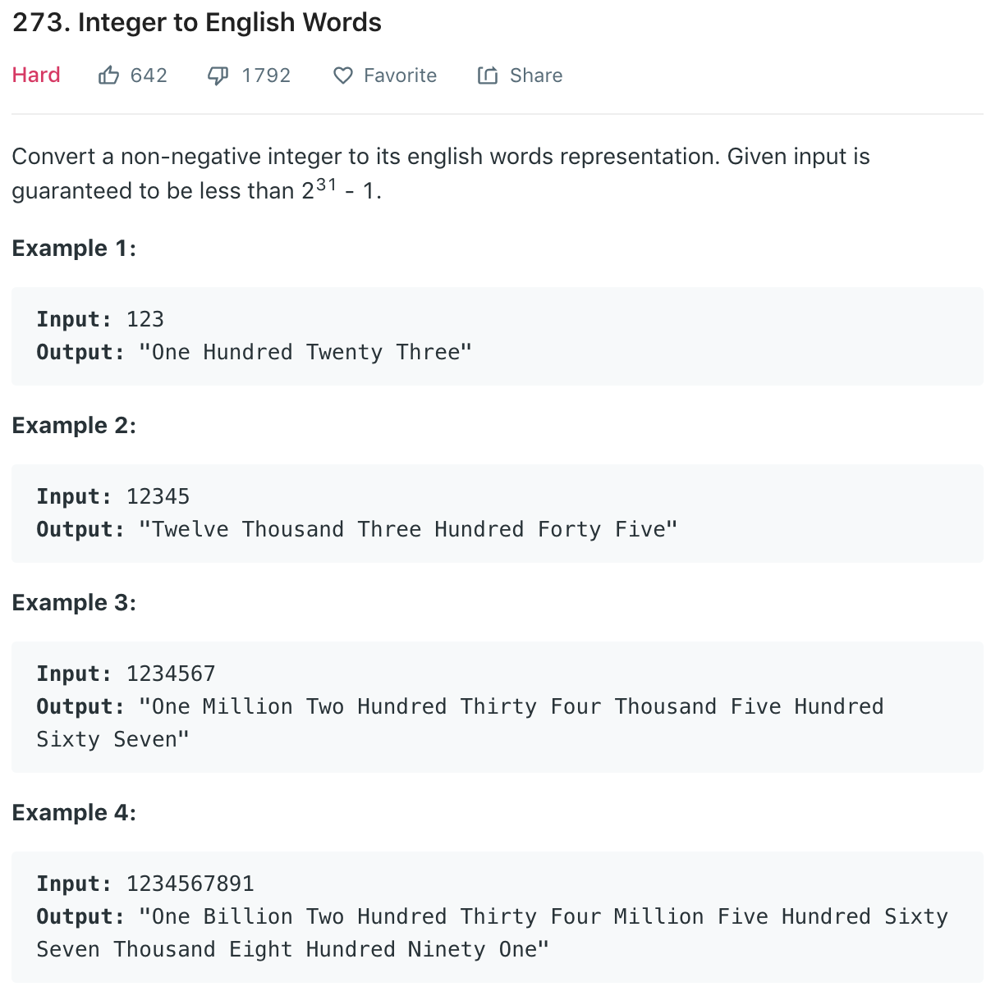

### Solution 
```python
class Solution(object):
    LESS_THAN_20 = ["", "One", "Two", "Three", "Four", "Five", "Six", "Seven", "Eight", "Nine", "Ten", "Eleven",
                    "Twelve", "Thirteen", "Fourteen", "Fifteen", "Sixteen", "Seventeen", "Eighteen", "Nineteen"]
    TENS = ["", "Ten", "Twenty", "Thirty", "Forty", "Fifty", "Sixty", "Seventy", "Eighty", "Ninety"]
    THOUSANDS = ["", "Thousand", "Million", "Billion"]

    def numberToWords(self, num):
        """
        :type num: int
        :rtype: str
        """

        if num == 0: return "Zero"

        i = 0
        words = ""

        while num > 0:
            if num % 1000 != 0:
                words = self.helper(num % 1000) + Solution.THOUSANDS[i] + " " + words
            num //= 1000
            i += 1

        return words.strip()

    def helper(self, num):
        # helper takes in num < 1000
        if num == 0: return ""
        elif num < 20:
            return Solution.LESS_THAN_20[num] + " "
        elif num < 100:
            return Solution.TENS[num // 10] + " " + self.helper(num % 10)
        else:
            return Solution.LESS_THAN_20[num // 100] + " Hundred " + self.helper(num % 100)

    def numToWords(self, num):
        belowTen = ["", "One", "Two", "Three", "Four", "Five", "Six", "Seven", "Eight", "Nine"]
        belowTwenty = ["Ten", "Eleven", "Twelve", "Thirteen", "Fourteen", "Fifteen", "Sixteen", "Seventeen", "Eighteen", "Nineteen"]
        belowHundred = ["", "Ten", "Twenty", "Thirty", "Forty", "Fifty", "Sixty", "Seventy", "Eighty", "Ninety"]

        def helper(num):
            res = ""
            if num < 10: res = belowTen[num]
            elif num < 20: res = belowTwenty[num - 10]
            elif num < 100: res = belowHundred[num // 10] + " " + helper(num % 10)
            elif num < 1000: res = helper(num // 100) + " Hundred " + helper(num % 100)
            elif num < 1000000: res = helper(num // 1000) + " Thousand " + helper(num % 1000)
            elif num < 1000000000: res = helper(num // 1000000) + " Million " + helper(num % 1000000)
            else: res = helper(num // 1000000000) + " Billion " + helper(num % 1000000000)
            return res.strip()

        # seperate the stand-alone 0 and 0 in 20 etc
        if num == 0: return "Zero"
        return helper(num)
```