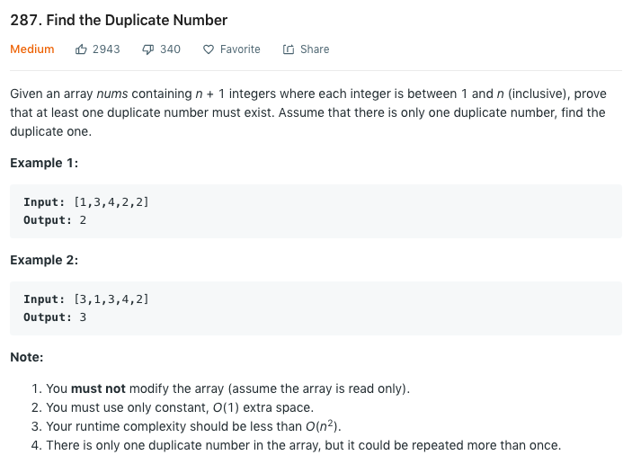

### Solution
Similar to find cycle in linked list.
Refer to [this](https://leetcode.com/problems/find-the-duplicate-number/discuss/72846/My-easy-understood-solution-with-O(n)-time-and-O(1)-space-without-modifying-the-array.-With-clear-explanation.). [141](141.md), [142](142.md)
```python
class Solution(object):
    def findDuplicate(self, nums):
        """
        :type nums: List[int]
        :rtype: int
        """
        if len(nums) < 2:
            return -1
        
        slow, fast = nums[0], nums[nums[0]]
        while slow != fast:
            slow = nums[slow]
            fast = nums[nums[fast]]
        
        fast = 0
        while fast != slow:
            fast = nums[fast]
            slow = nums[slow]
        
        return slow
```