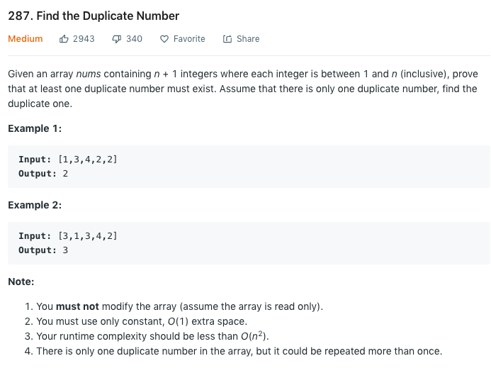

### Solution
Similar to find cycle in linked list.
Refer to [this](https://leetcode.com/problems/find-the-duplicate-number/discuss/72846/My-easy-understood-solution-with-O(n)-time-and-O(1)-space-without-modifying-the-array.-With-clear-explanation.). [141](141.md), [142](142.md)
```python
class Solution(object):
    def findDuplicate(self, nums):
        """
        :type nums: List[int]
        :rtype: int
        """
        if len(nums) < 2:
            return -1
        
        slow, fast = nums[0], nums[nums[0]]
        while slow != fast:
            slow = nums[slow]
            fast = nums[nums[fast]]
        
        fast = 0
        while fast != slow:
            fast = nums[fast]
            slow = nums[slow]
        
        return slow
```
or
```python
def findDuplicate(nums):
    # 初始化
    slow, fast = nums[0], nums[0]
    
    # 第一阶段：找相遇点
    while True:
        slow = nums[slow]           # 走一步
        fast = nums[nums[fast]]     # 走两步
        if slow == fast:
            break
            
    # 第二阶段：找入口（重复的那个数字）
    slow = nums[0]                  # 乌龟回到起点
    while slow != fast:
        slow = nums[slow]           # 大家都走一步
        fast = nums[fast]
        
    return slow
```
or
```python
class Solution:
    def findDuplicate(self, nums: List[int]) -> int:
        slow, fast = 0, 0
        while True:
            slow = nums[slow]
            fast = nums[nums[fast]]
            if slow == fast:
                break

        slow2 = 0
        while True:
            slow = nums[slow]
            slow2 = nums[slow2]
            if slow == slow2:
                return slow
```