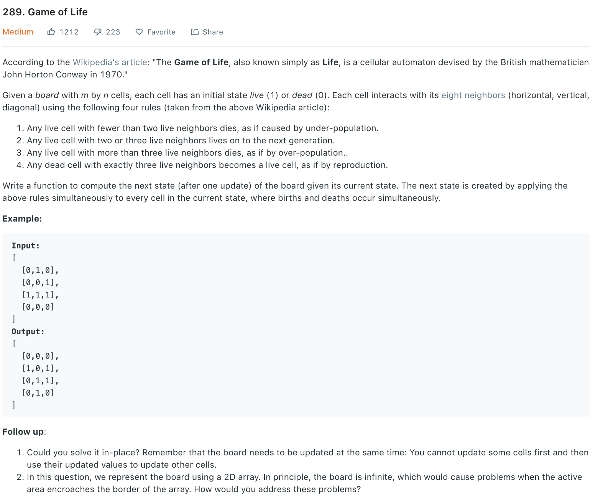

### Solution 1
```python
class Solution(object):
    def gameOfLife(self, board):
        """
        :type board: List[List[int]]
        :rtype: None Do not return anything, modify board in-place instead.
        """
        r, c = len(board), len(board[0])
        countBoard = [[0] * c for _ in range(r)]

        # countBoard[i][j] is the number of 1 nbrs around boad[i][j]
        for i in range(r):
            for j in range(c):
                if board[i][j] == 0:
                    continue
                # 8 nbrs
                if i > 0: countBoard[i - 1][j] += 1
                if j > 0: countBoard[i][j - 1] += 1
                if i < r - 1: countBoard[i + 1][j] += 1
                if j < c - 1: countBoard[i][j + 1] += 1
                if i > 0 and j > 0: countBoard[i - 1][j - 1] += 1
                if i > 0 and j < c - 1: countBoard[i - 1][j + 1] += 1
                if i < r - 1 and j > 0: countBoard[i + 1][j - 1] += 1
                if i < r - 1 and j < c - 1: countBoard[i + 1][j + 1] += 1

        # state transition using countBoard
        for i in range(r):
            for j in range(c):
                if board[i][j] == 0:
                    if countBoard[i][j] == 3:
                        board[i][j] = 1
                else:
                    if countBoard[i][j] < 2 or countBoard[i][j] > 3:
                        board[i][j] = 0
```
+ Time complexity: O(n)
+ Space complexity: O(n)
### Solution 2
Refer to [here](https://leetcode.com/problems/game-of-life/discuss/73223/Easiest-JAVA-solution-with-explanation).
To solve it in place, we use 2 bits to store 2 states:

`[2nd bit, 1st bit] = [next state, current state]`

- 00  dead (next) <- dead (current)
- 01  dead (next) <- live (current)  
- 10  live (next) <- dead (current)  
- 11  live (next) <- live (current) 

In the beginning, every cell is either 00 or 01.
Notice that 1st state is independent of 2nd state.
Imagine all cells are instantly changing from the 1st to the 2nd state, at the same time.
Let's count # of neighbors from 1st state and set 2nd state bit.
Since every 2nd state is by default dead, no need to consider transition `01 -> 00`.
In the end, delete every cell's 1st state by doing `>> 1`.
For each cell's 1st bit, check the 8 pixels around itself, and set the cell's 2nd bit.
```
Transition 01 -> 11: when board == 1 and lives >= 2 && lives <= 3.
Transition 00 -> 10: when board == 0 and lives == 3.
```
- To get the current state, simply do `board[i][j] & 1`
- To get the next state, simply do `board[i][j] >> 1`
```python
def gameOfLife(board):
    if not board or not board[0]: return

    m, n = len(board), len(board[0])
    for i in range(m):
        for j in range(n):
            lives = getLiveNbrs(board, m, n, i, j)

            # In the beginning, every 2nd bit is 0;
            # So we only need to care about when will the 2nd bit become 1.
            if board[i][j] == 1 and (2 <= lives <= 3):
                board[i][j] = 3 #Make the 2nd bit 1: 01 ---> 11
            if board[i][j] == 0 and lives == 3:
                board[i][j] = 2 #Make the 2nd bit 1: 00 ---> 10

    for i in range(m):
        for j in range(n):
            board[i][j] >>= 1 #Get the 2nd state.

def getLiveNbrs(board, m, n, i, j):
    lives = 0
    # CAREFUL about right boundary
    for x in range(max(i - 1, 0), min(i + 1, m - 1) + 1):
        for y in range(max(j - 1, 0), min(j + 1, n - 1) + 1):
            lives += (board[x][y] & 1)

    lives -= (board[i][j] & 1)
    return lives
```