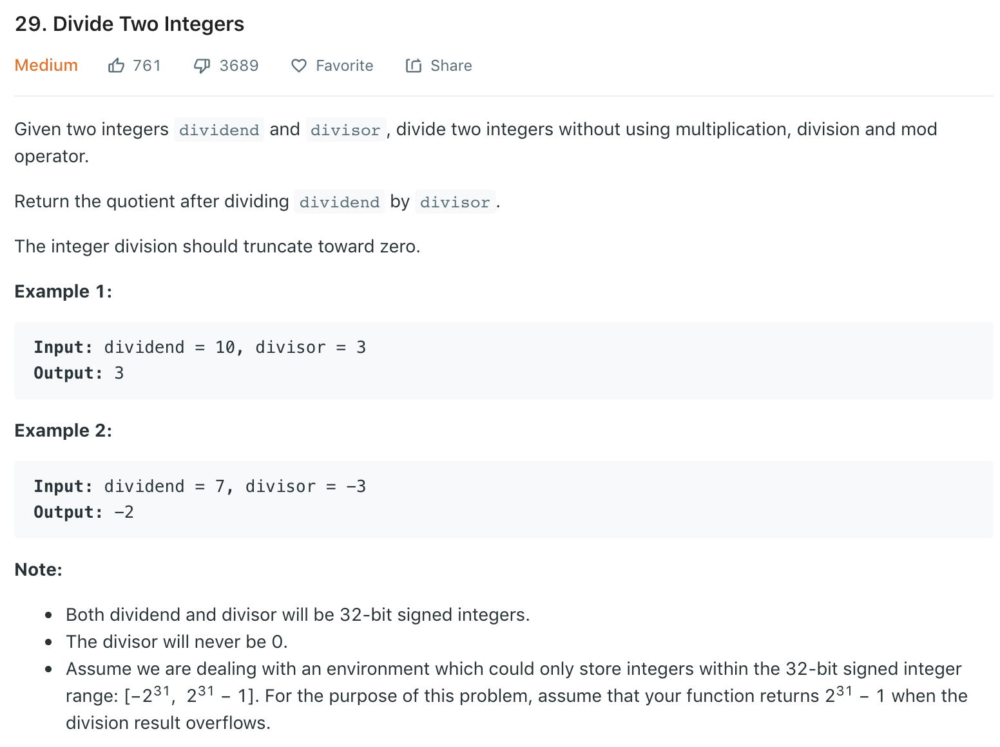

### Solution 1 TLE
Repeatedly subtract divisor from divident, until divident is less than divisor.
```python
class Solution(object):
    def divide(self, dividend, divisor):
        """
        :type dividend: int
        :type divisor: int
        :rtype: int
        """
        isPositive = True
        if (dividend > 0) is not (divisor > 0): isPositive = False
        
        dividend, divisor = abs(dividend), abs(divisor)
        count = 0
        while dividend >= divisor:
            dividend -= divisor
            count += 1
        
        if not isPositive: count = -count
        
        return count
```
### Solution 2
Since it's too slow to subtract only divisor each time, we double divisor until it's bigger than divident.
```python
def divide(dividend, divisor):
        isPositive = True
        if (dividend > 0) is not (divisor > 0): isPositive = False
        
        dividend, divisor = abs(dividend), abs(divisor)
        res = 0

        while dividend >= divisor:
            div, count = divisor, 1
            while dividend >= (div << 1):
                count <<= 1
                div <<= 1
            dividend -= div
            res += count
        
        if not isPositive: res = -res

        return min(max(-1<<31, res), (1<<31) - 1)
```