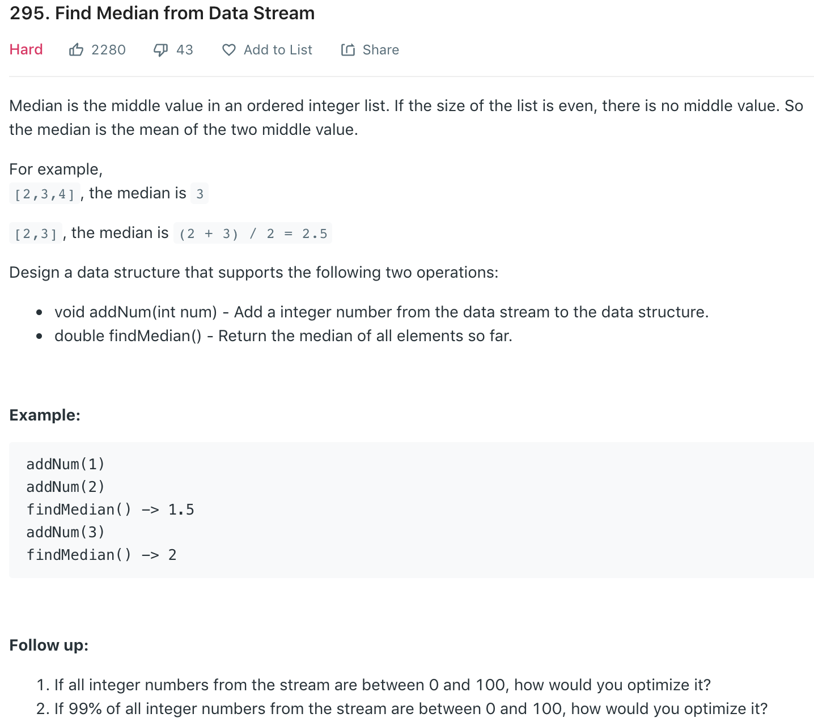

refer to [here](https://leetcode.wang/leetcode-295-Find-Median-from-Data-Stream.html).
```python
from heapq import *

class MedianFinder:

    def __init__(self):
        self.heaps = [], []

    def addNum(self, num):
        small, large = self.heaps
        heappush(small, -heappushpop(large, num))
        if len(large) < len(small):
            heappush(large, -heappop(small))

    def findMedian(self):
        small, large = self.heaps
        if len(large) > len(small):
            return float(large[0])
        return (large[0] - small[0]) / 2.0
```