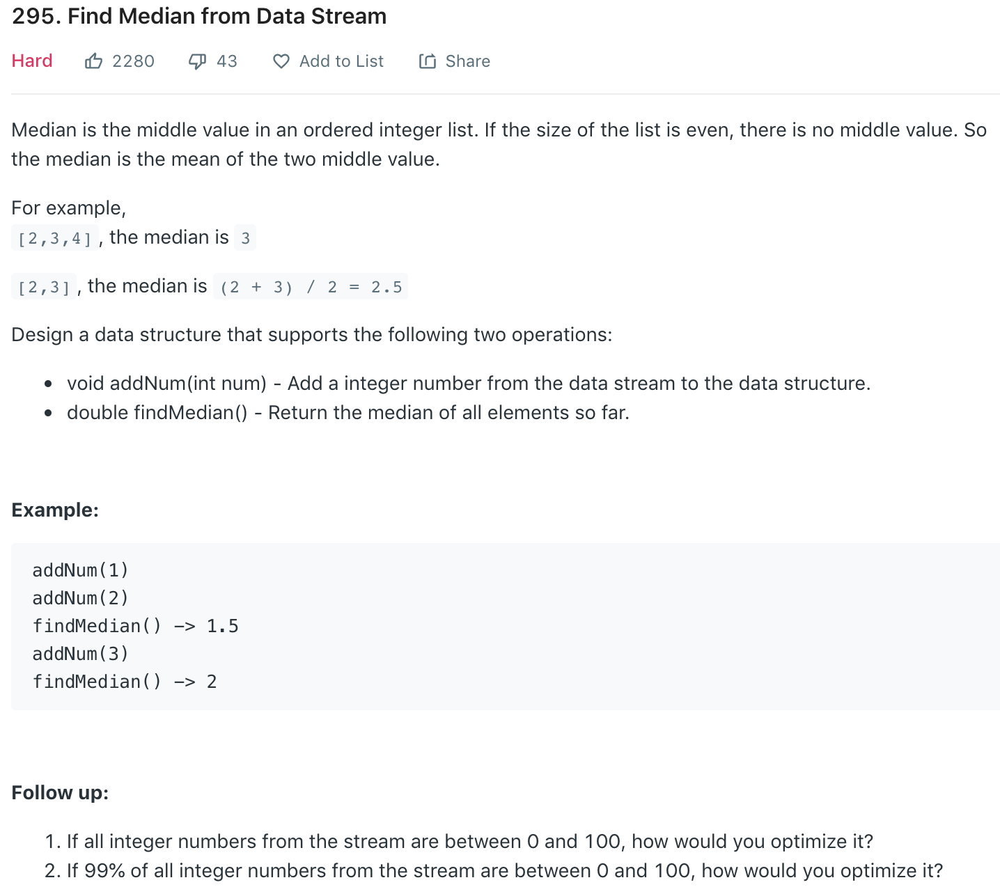

# Find median from data stream

refer to [here](https://leetcode.wang/leetcode-295-Find-Median-from-Data-Stream.html).
```python
from heapq import *

class MedianFinder:
    def __init__(self):
        self.heaps = [], []

    def addNum(self, num):
        small, large = self.heaps
        heappush(small, -heappushpop(large, num))
        if len(large) < len(small):
            heappush(large, -heappop(small))

    def findMedian(self):
        small, large = self.heaps
        if len(large) > len(small):
            return float(large[0])
        return (large[0] - small[0]) / 2.0
```

## Solution 2
```python
import heapq

class MedianFinder:

    def __init__(self):
        # small 是大顶堆 (存储较小的一半)，Python 需存负数实现
        # large 是小顶堆 (存储较大的一半)
        self.small, self.large = [], [] 

    def addNum(self, num: int) -> None:
        # 步骤 1: 决定加到哪边
        # 如果 num 比左半部分最大的还小，加到 small
        if not self.small or num <= -self.small[0]:
            heapq.heappush(self.small, -num)
        else:
            heapq.heappush(self.large, num)
        
        # 步骤 2: 平衡两个堆的大小，确保长度差不超过 1
        if len(self.small) > len(self.large) + 1:
            # small 太多了，挪一个去 large
            val = -heapq.heappop(self.small)
            heapq.heappush(self.large, val)
        elif len(self.large) > len(self.small) + 1:
            # large 太多了，挪一个去 small
            val = heapq.heappop(self.large)
            heapq.heappush(self.small, -val)

    def findMedian(self) -> float:
        if len(self.small) > len(self.large):
            return float(-self.small[0])
        elif len(self.large) > len(self.small):
            return float(self.large[0])
        else:
            # 两个堆一样大，取堆顶平均值
            # 注意：-self.small[0] 是正数，self.large[0] 也是正数
            return (-self.small[0] + self.large[0]) / 2.0
```