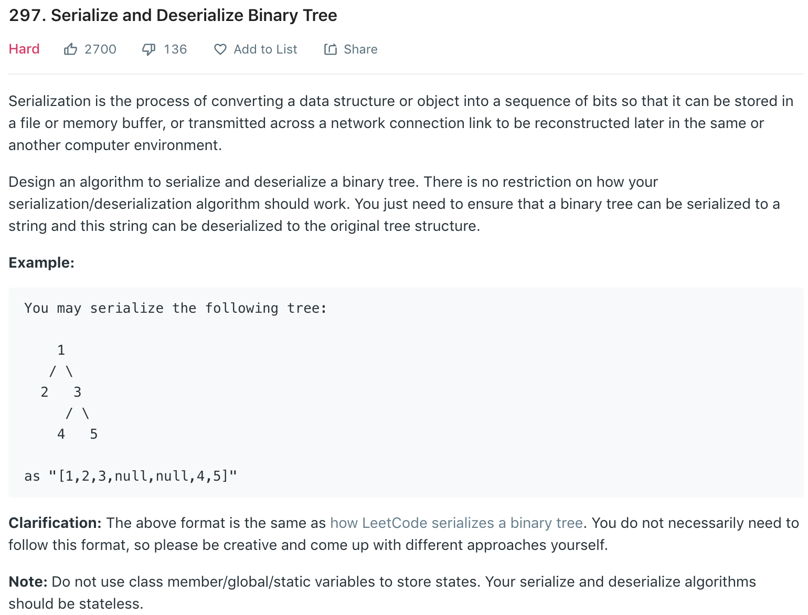

### Solution 1
reconstruct a binary tree from preorder and inorder traversal. *However*, this does not apply when treenode values are not unique.

### Solution 2 BFS with Null
```python
# Definition for a binary tree node.
# class TreeNode(object):
#     def __init__(self, x):
#         self.val = x
#         self.left = None
#         self.right = None

class Codec:
    def serialize(self, root):
        """Encodes a tree to a single string.
        
        :type root: TreeNode
        :rtype: str
        """
        if not root: return ""
        ret = []
        q = [root]
        while q:
            n = len(q)
            for _ in range(n):
                cur = q.pop(0)
                if cur:
                    ret.append(str(cur.val))
                    q.append(cur.left)
                    q.append(cur.right)
                else:
                    ret.append('n')
        return ','.join(ret)

    def deserialize(self, data):
        """Decodes your encoded data to tree.
        
        :type data: str
        :rtype: TreeNode
        """
        if not data: return None

        values = data.split(sep=',')
        root = TreeNode(int(values[0]))
        q = [root]
        i = 1
        
        while i < len(values):
            parent = q.pop(0)
            if values[i] != 'n':
                left = TreeNode(int(values[i]))
                parent.left = left
                q.append(left)
            i += 1
            if values[i] != 'n':
                right = TreeNode(int(values[i]))
                parent.right = right
                q.append(right)
            i += 1
        
        return root
        

# Your Codec object will be instantiated and called as such:
# codec = Codec()
# codec.deserialize(codec.serialize(root))
```