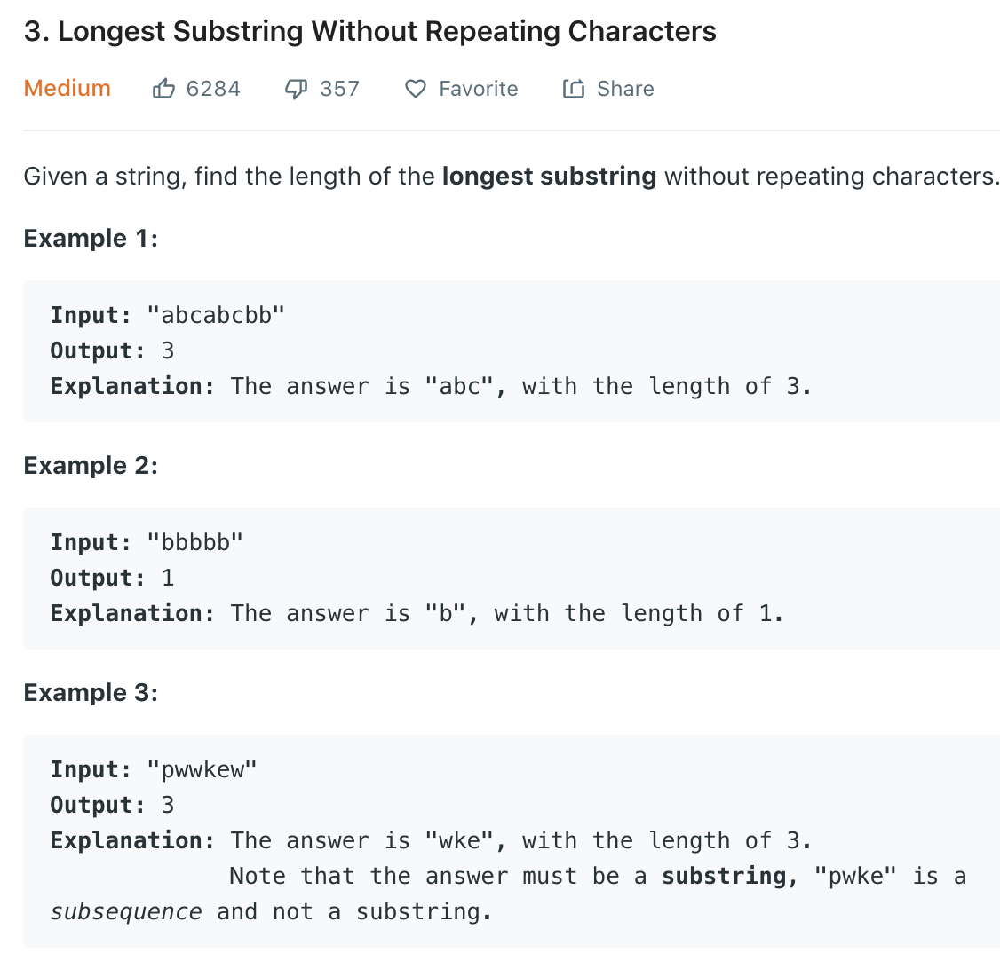

### Solution
```python
class Solution(object):
    def lengthOfLongestSubstring(self, s):
        """
        :type s: str
        :rtype: int
        """
        if not s: return 0

        max_len = 1
        start, end = 0, 0
        seen = dict()

        while end < len(s):
            if s[end] not in seen or seen[s[end]] == -1:
                seen[s[end]] = end
                if end == len(s) - 1:
                    max_len = max(max_len, end - start + 1)
            else:
                cur_len = end - start
                max_len = max(max_len, cur_len)
                start = seen[s[end]] + 1
                seen[s[end]] = end
                for c in seen:
                    if seen[c] < start:
                        seen[c] = -1
            end += 1

        return max_len
```