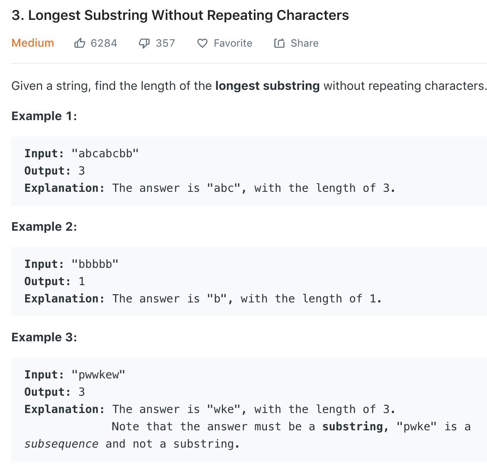

## Longest Substring Without Repeating Characters

### Solution
```python
class Solution(object):
    def lengthOfLongestSubstring(self, s):
        """
        :type s: str
        :rtype: int
        """
        if not s: return 0

        max_len = 1
        start, end = 0, 0
        seen = dict()

        while end < len(s):
            if s[end] not in seen or seen[s[end]] == -1:
                seen[s[end]] = end
                if end == len(s) - 1:
                    max_len = max(max_len, end - start + 1)
            else:
            # corner case
            # "tmmzuxt"
                # cur_len = end - start
                # max_len = max(max_len, cur_len)
                start = seen[s[end]] + 1
                seen[s[end]] = end
                for c in seen:
                # mark character before as unseen as it is not in our window
                    if seen[c] < start:
                        seen[c] = -1
            end += 1

        return max_len
```
Actually we do not need to unmark characters
```python
def lengthOfLongestSubstring(s):
    used = {}
    max_length = start = 0
    for i, c in enumerate(s):
        if c in used and start <= used[c]:
            start = used[c] + 1
        else:
            max_length = max(max_length, i - start + 1)
            
        used[c] = i

    
    return max_length
```

or
```python
def lengthOfLongestSubstring(self, s: str) -> int:
    if len(s) < 2: return len(s)
    start, end = 0, 1
    seen = {s[0]: 0}
    maxLen = 0
    while end < len(s):
        c = s[end]
        if c in seen and seen[c] >= start:
            maxLen = max(maxLen, end - start)
            start = seen[c] + 1
        seen[c] = end
        end += 1
    maxLen = max(maxLen, end - start)
    return maxLen
```