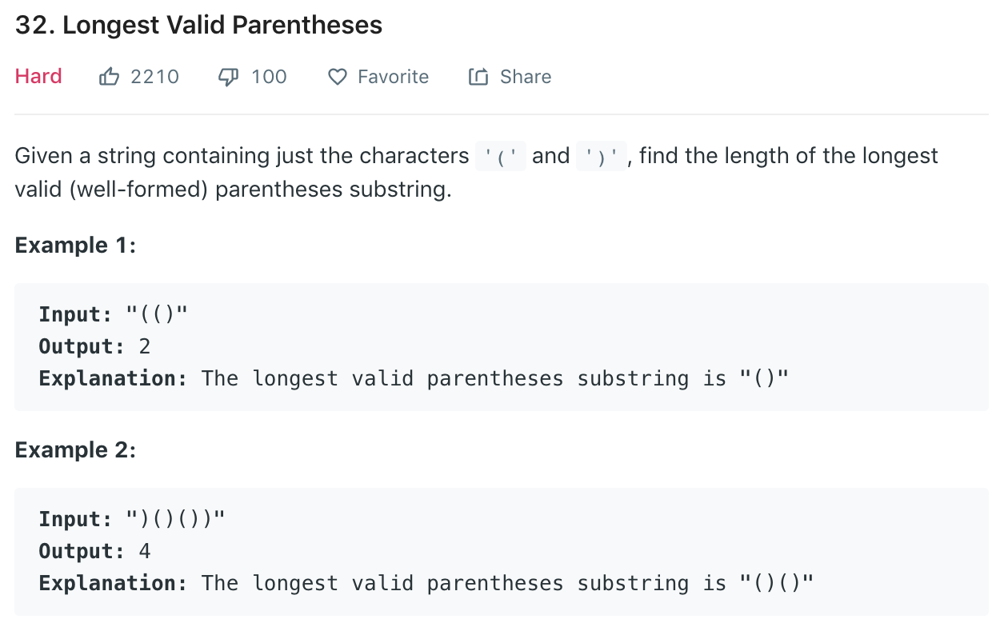

### Solution Stack
```python
class Solution(object):
    def longestValidParentheses(self, s):
        """
        :type s: str
        :rtype: int
        """
        if not s: return 0
        # stack stores indexes of all invalid bracket
        stack = []
        for i in range(len(s)):
            if s[i] == ')' and stack and s[stack[-1]] == '(':
                stack.pop()
            else:
                stack.append(i)
        # all brackets all valid        
        if len(stack) == 0: return len(s)
        
        # calc longest interval
        res = max(stack[0], len(s) - stack[-1] - 1)
        for i in range(1, len(stack)):
            res = max(res, stack[i] - stack[i - 1] - 1)
        
        return res
```
We can also calc valid pair length on the fly