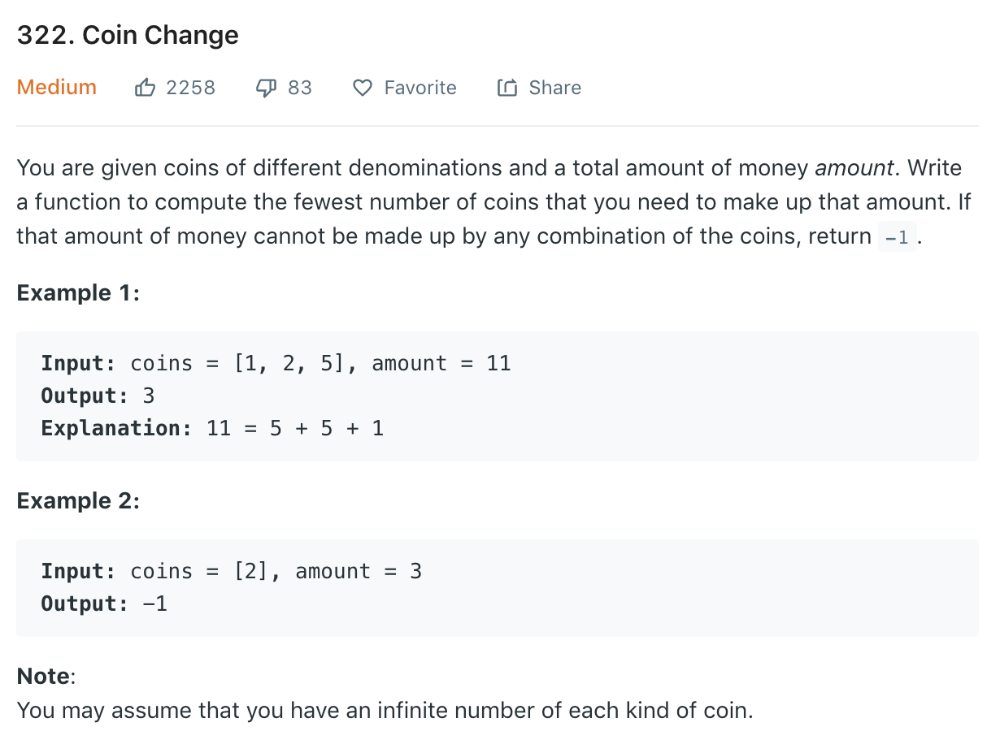

### Solution Brutal Force
Return all possible combination
```python
class Solution(object):
    def coinChange(self, coins, amount):
        """
        :type coins: List[int]
        :type amount: int
        :rtype: int
        """
        # coins.sort(reverse=True)
        coins.sort()
        ret = []
        self.helper(coins, amount, 0, [], ret)
        return ret
    
    def helper(self, coins, rem, start, path, res):
        if rem == 0:
            res.append(path)
            return
        
        for i in range(start, len(coins)):
            if rem < coins[i]:
                return
            self.helper(coins, rem - coins[i], i, path + [coins[i]], res)
```

### Solution DFS with pruning
```python
class Solution(object):
    def coinChange(self, coins, amount):
        """
        :type coins: List[int]
        :type amount: int
        :rtype: int
        """
        coins.sort(reverse=True)
        lenc, self.res = len(coins), 2 ** 31 - 1

        def dfs(pt, rem, count):
            if rem == 0:
                self.res = min(self.res, count)
                return

            for i in range(pt, lenc):
                if coins[i] <= rem < coins[i] * (self.res - count):  # if hope still exists
                    dfs(i, rem - coins[i], count + 1)

        # for i in range(lenc):
        #     dfs(i, amount, 0)
        dfs(i, amount, 0)

        return self.res if self.res < 2 ** 31 - 1 else -1
```
### Solution 2 DP
```python
    # DP dp[i] is the number of minimum coins to get i
def coinChange3(self, coins, amount):
    dp = [0] + [float('inf') for i in range(amount)]
    for i in range(1, amount+1):
        for coin in coins:
            if i - coin >= 0:
                dp[i] = min(dp[i], dp[i-coin] + 1)
    if dp[-1] == float('inf'):
        return -1
    return dp[-1]
```