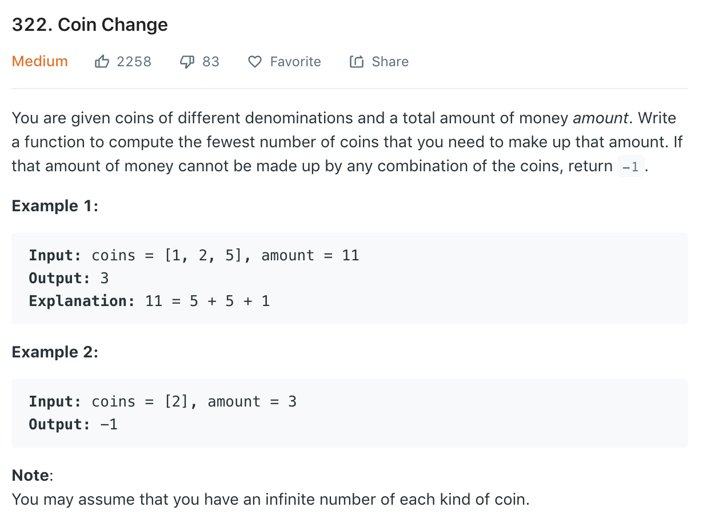

# Coin change


You are given an integer array coins representing coins of different denominations (e.g. 1 dollar, 5 dollars, etc) and an integer amount representing a target amount of money.

Return the fewest number of coins that you need to make up the exact target amount. If it is impossible to make up the amount, return -1.

You may assume that you have an unlimited number of each coin.

Example 1:

Input: coins = [1,5,10], amount = 12

Output: 3
Explanation: 12 = 10 + 1 + 1. Note that we do not have to use every kind coin available.

Example 2:

Input: coins = [2], amount = 3

Output: -1
Explanation: The amount of 3 cannot be made up with coins of 2.

Example 3:

Input: coins = [1], amount = 0

Output: 0
Explanation: Choosing 0 coins is a valid way to make up 0.
### Solution Brutal Force
Return all possible combination
```python
class Solution(object):
    def coinChange(self, coins, amount):
        """
        :type coins: List[int]
        :type amount: int
        :rtype: int
        """
        # coins.sort(reverse=True)
        coins.sort()
        ret = []
        self.helper(coins, amount, 0, [], ret)
        return ret
    
    def helper(self, coins, rem, start, path, res):
        if rem == 0:
            res.append(path)
            return
        
        for i in range(start, len(coins)):
            if rem < coins[i]:
                return
            self.helper(coins, rem - coins[i], i, path + [coins[i]], res)
```

### Solution DFS with pruning (no return)
```python
class Solution(object):
    def coinChange(self, coins, amount):
        """
        :type coins: List[int]
        :type amount: int
        :rtype: int
        """
        coins.sort(reverse=True)
        lenc, self.res = len(coins), 2 ** 31 - 1
 
        def dfs(pt, rem, count):
            if rem == 0:
                self.res = min(self.res, count)
                return

            for i in range(pt, lenc):
                # if hope still exists
                if coins[i] <= rem < coins[i] * (self.res - count):  
                    dfs(i, rem - coins[i], count + 1)

        # for i in range(lenc):
        #     dfs(i, amount, 0)
        dfs(0, amount, 0)

        return self.res if self.res < 2 ** 31 - 1 else -1
```

### DFS with return and memoization
```python
class Solution:
    def coinChange(self, coins: List[int], amount: int) -> int:
        coins.sort(reverse=True)
        mp = {0:0}
        def dfs(amt):
            if amt < 0: return -1
            if amt in mp:
                return mp[amt]
            cnt = float('inf')
            for c in coins:
                if amt >= c:
                    val = dfs(amt-c)
                    if val != -1:
                        cnt = min(cnt, dfs(amt-c)+1)
            if cnt == float('inf'): cnt = -1
            mp[amt] = cnt
            return cnt
        return dfs(amount)
```

### Solution 2 DP
```python
    # DP dp[i] is the number of minimum coins to get i
def coinChange3(self, coins, amount):
    dp = [0] + [float('inf') for i in range(amount)]
    for i in range(1, amount+1):
        for coin in coins:
            if i - coin >= 0:
                dp[i] = min(dp[i], dp[i-coin] + 1)
    if dp[-1] == float('inf'):
        return -1
    return dp[-1]
```

### mutant: total number of coin changes
Wrong solution!! (dups), for ex: [1, 5] target 6
pick 1: dfs(5) = 2([5], [1, 1, 1, 1, 1]) -> [1, 5], [1, 1, 1, 1, 1, 1]
pick 5: dfs(1) = 1 ([1]) -> [5, 1]
[1, 5] and [5, 1] are dups
```python
class Solution:
    def coinChange(self, coins: List[int], amount: int) -> int:
        coins.sort(reverse=True)
        mp = {0:0}
        def dfs(amt):
            if amt < 0: return -1
            if amt in mp:
                return mp[amt]
            cnt = 0
            for c in coins:
                if amt >= c:
                    cnt += dfs(amt-c)+1
            if cnt == 0: cnt = -1
            mp[amt] = cnt
            return cnt
        return dfs(amount)
```