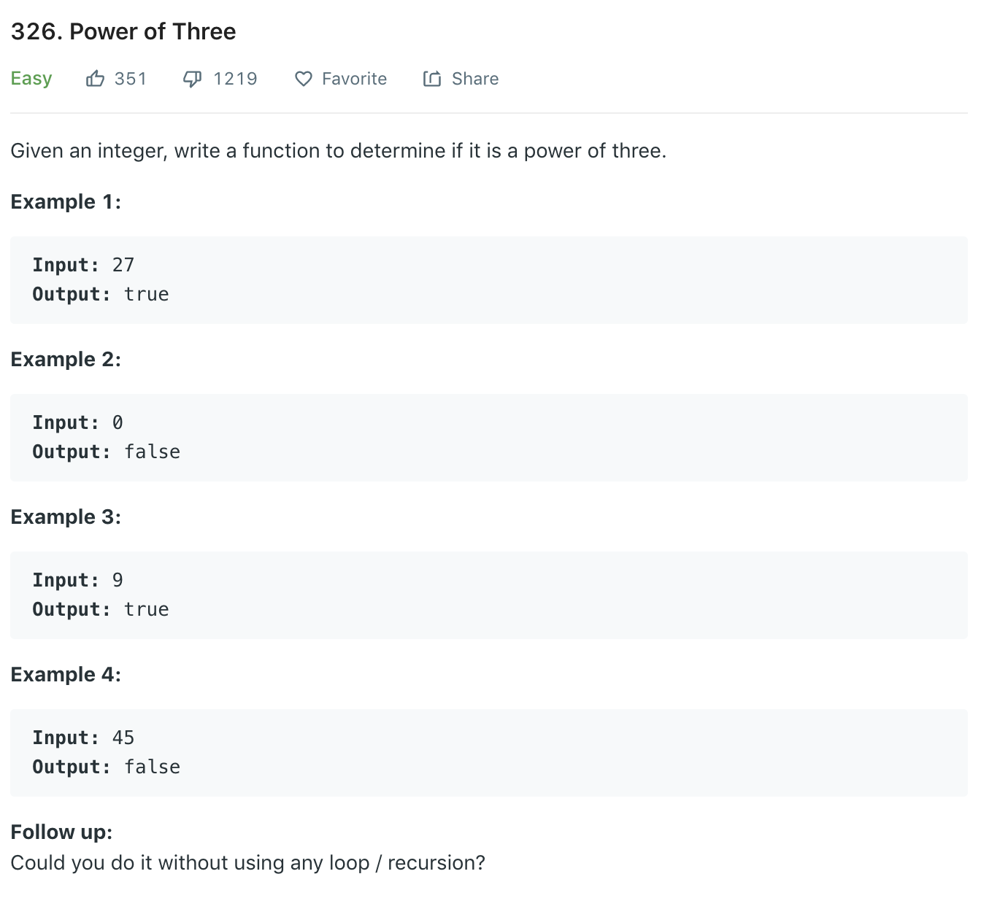

A [summary](https://leetcode.com/problems/power-of-three/discuss/77876/**-A-summary-of-all-solutions-(new-method-included-at-15%3A30pm-Jan-8th)).
### Solution 1
```python
class Solution(object):
    def isPowerOfThree(self, n):
        """
        :type n: int
        :rtype: bool
        """
        if n < 1: return False
        
        while n != 1:
            if n % 3 != 0:
                return False
            n //= 3
        
        return True
```
Time complexity: O(log(N))
Space complexity: O(1)

### Solution 2 Math
```python
def isPowerOfThree(n):
    # 3^20 > maxInt32
    return n > 0 and 3**19 % n == 0
```